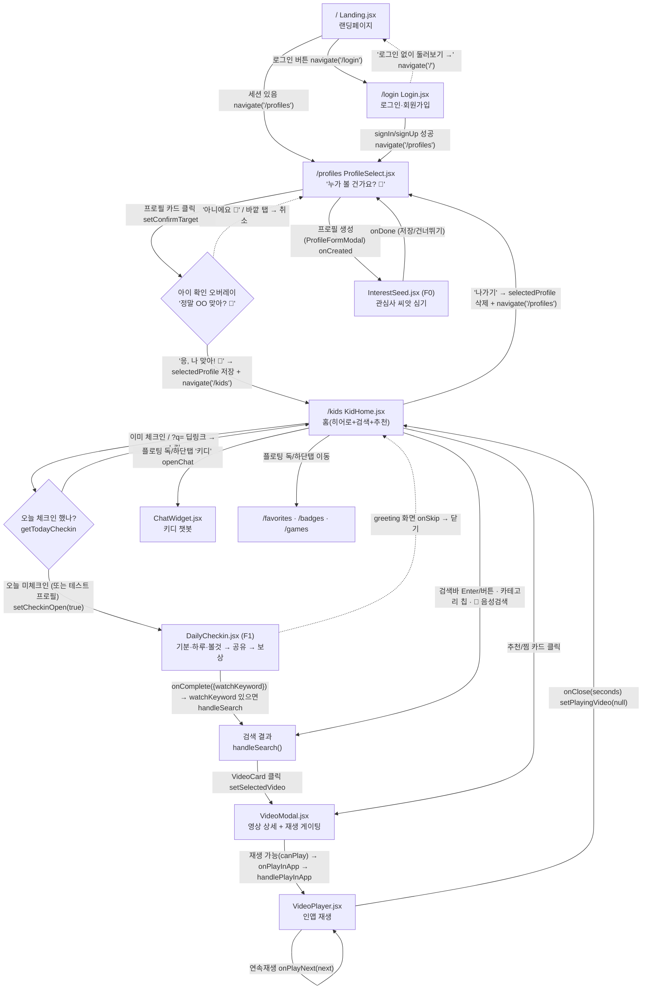
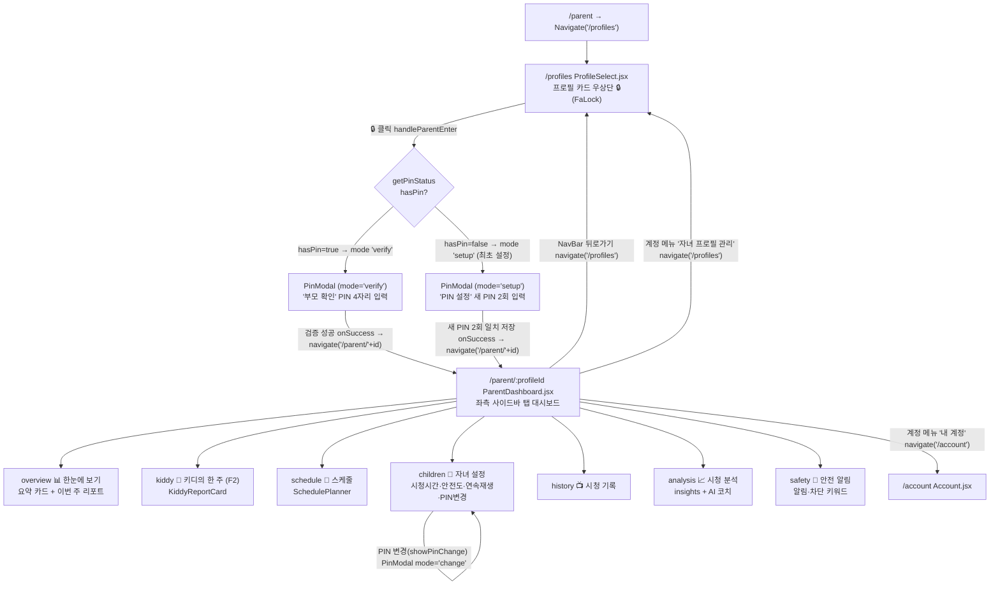

# 📘 KidSafe(Kiddy) — 기능·시스템 명세서

> **작성일:** 2026-07-02 · **대상:** 포트폴리오 / 현황 파악
> **조사 방법:** 실제 코드베이스를 멀티에이전트로 조사해 **모든 사실에 `파일:줄` 근거**를 붙였습니다. 추측·기억이 아니라 코드에서 확인된 것만 기재하고, 확인 불가 항목은 그대로 "⚠️ 확인 불가"로 남겼습니다.

## 🖼️ 스크린샷 안내 (먼저 읽어주세요)
이 문서는 코드에서 뽑은 **텍스트/근거는 전부** 채워져 있지만, **실제 화면 스크린샷 이미지는 포함돼 있지 않습니다.** (실행 중인 앱을 캡처하지 않는 한 이미지를 만들 수 없어서요.) 대신 각 기능 표 아래에 **`> 📸 [스크린샷 필요: …]`** 자리표시자를 넣어두었습니다. 앱을 띄워 해당 화면을 캡처해 그 자리에 붙이면 됩니다. — *원하시면 앱을 실행해 화면별 캡처를 도와드릴 수 있습니다.*

## ⭐ 핵심 발견 요약 (검토 시 먼저 볼 것)
- **분석 모델은 Sonnet이 아니라 전 경로 `claude-haiku-4-5-20251001`(Haiku)** 입니다. (감정 리포트·코치·키디 반응·챗봇 모두) — §4, §3
- **`hadSecrets`는 저장 필드가 아니라 부모 리포트 응답에서 서버가 파생하는 boolean** 입니다. 입력/DB의 실제 필드는 `shareWithParent`/`share_with_parent`(+ followup `secret`). — §4
- **아이의 비밀(공유 안 함) 원본 답은 부모 리포트·LLM 프롬프트·화면 어디에도 노출되지 않습니다**(리포트 생성·응답·화면 3중 방어). 단, ⚠️ raw-read 체크인 엔드포인트에는 역할 기반 인가가 없어 UI 우회 직접 호출 시 노출 가능(현재 부모 UI는 호출 안 함). — §4
- **챗봇/자유입력에는 입력 필터가 없습니다.** 위험 발화 차단은 **모델 시스템 프롬프트 규칙에만 의존**(차단 키워드는 '검색'에만 적용). — §3
- **미구현/계획만:** 구독 결제(토스), 회원 탈퇴 백엔드, F3 리터러시. **배포 전 정리:** `CHECKIN_TEST_PROFILE="해인"` 테스트 플래그, 배지 백엔드↔프론트 표시 불일치 2건. — §1, §5

## 📑 목차
1. [기능 현황표](#1-기능-현황표)
2. [랜딩페이지 전체 카피 텍스트](#2-랜딩페이지-전체-카피-텍스트)
3. [키디 대화 시스템 명세](#3-키디-대화-시스템-명세)
4. [감정 데이터 흐름도](#4-감정-데이터-흐름도)
5. [배지 시스템 트리거 전체 목록](#5-배지-시스템-트리거-전체-목록)
6. [화면 흐름도 (아이 / 부모)](#6-화면-흐름도-아이--부모)

---

## 1. 기능 현황표

> 판정 기준: **✅ 구현 완료**(코드가 실제로 렌더/등록·호출됨) · **🔨 진행 중**(코드는 있으나 비활성/미완/부분) · **📝 계획만**(스텁·alert·주석·백엔드 부재).
> 모든 근거는 실제 코드의 `파일:줄` 이며, 확인 못 한 항목은 "⚠️ 코드에서 확인 불가"로 표기했다.

라우팅은 `client/src/App.jsx:34-47`(공개 `/`·`/login`, 보호 `/parent/:profileId`·`/profiles`·`/kids`·`/favorites`·`/badges`·`/games`·`/account`·`/admin`), 백엔드 라우터 등록은 `server/main.py:41`(import)·`58-79`(`include_router`)에서 확인.

---

### 1. 인증 · 계정 · 멤버십

| 기능 | 상태 | 근거(file:line) | 비고 |
|---|---|---|---|
| 로그인/보호 라우트 | ✅ | `client/src/App.jsx:40-47`, `client/src/components/ProtectedRoute.jsx` | Supabase Auth 토큰을 우리 백엔드 요청에 자동 첨부 `client/src/utils/api.js:6-10` |
| 내 계정(이름/비번 변경·로그아웃) | ✅ | `client/src/pages/Account.jsx:33-74` | Supabase `updateUser` 직접 호출 |
| 권한 상태 조회(role·프리미엄) | ✅ | `server/routers/me.py:7-27` (`GET /me/status`), 소비처 `client/src/utils/api.js:459` | `accounts.role` + `subscriptions(plan=premium,status=active)` |
| 프리미엄 부여/해제(관리자) | ✅ | `server/routers/admin_users.py:132-162` | 관리자 수동 부여만 존재 |
| **구독 결제(토스페이먼츠)** | 📝 계획만 | `client/src/pages/Account.jsx:288-294` | 버튼이 `alert("구독 결제는 곧 오픈 예정이에요! (토스페이먼츠 연동 작업 중)")` 만 띄움. 결제 백엔드 없음 |
| **회원 탈퇴** | 📝 계획만 | `client/src/pages/Account.jsx:76-87` | `alert("회원 탈퇴는 현재 관리자에게 문의해주세요...")` 로 안내만. 삭제 엔드포인트 없음 |
| 광고 제거(프리미엄 혜택) | 📝 계획만 | `client/src/pages/Account.jsx:280` | 혜택 목록에 `"광고 제거 (예정)"` 로 표기 |

**📸 내 계정 · 멤버십 탭(결제 예정 안내)**


> <sub>▶ 촬영: 부모 로그인 → 우상단 계정 메뉴 → '멤버십 관리' (/account?tab=membership) · 파일 `screenshots/01-account-membership.png` — 아직 없으면 이미지 깨져 보임(미촬영 표시). 여러 장이면 `01-account-membership-a.png`, `01-account-membership-b.png`.</sub>

---

### 2. 프로필 · 멀티테넌시

| 기능 | 상태 | 근거(file:line) | 비고 |
|---|---|---|---|
| 프로필 CRUD | ✅ | `server/routers/profiles.py:57`(목록)·`75`(생성)·`115`(수정)·`202`(삭제) | 최대 4개 제한 `profiles.py:84-85` |
| 프로필 선택 화면 | ✅ | `client/src/pages/ProfileSelect.jsx` (라우트 `/profiles`) | 계정 진입을 프로필 선택 단계에 둠 |
| 프로필별 부모 PIN(설정/검증) | ✅ | `server/routers/profiles.py:168`(status)·`175`(set)·`192`(verify), UI `client/src/pages/ProfileSelect.jsx:474`(`PinModal`) | bcrypt류 해시 `pin_utils` |
| 프로필 삭제 시 종속데이터 정리 | ✅ | `server/routers/profiles.py:202-210` | DB cascade 의존 |
| 안전 기준(safetyThreshold) 프로필 연동 | ✅ | `server/routers/profiles.py:94`, `client/src/utils/safetyFilter.js`(getEffectiveThreshold), 소비처 `client/src/pages/KidHome.jsx:853` | 연령 기본값 3→90/5→85/7→80/10→70 |

**📸 프로필 선택 화면 + 부모 PIN 모달**


> <sub>▶ 촬영: /profiles 프로필 선택 화면 (부모 PIN 모달은 카드 우상단 🔒 클릭) · 파일 `screenshots/02-profile-select-pin.png` — 아직 없으면 이미지 깨져 보임(미촬영 표시). 여러 장이면 `02-profile-select-pin-a.png`, `02-profile-select-pin-b.png`.</sub>

---

### 3. 검색 · 추천

| 기능 | 상태 | 근거(file:line) | 비고 |
|---|---|---|---|
| YouTube 영상+재생목록 검색 | ✅ | `server/routers/search.py:212`(`GET /search`), 게임성 필터 `search.py:20-22`, 60초 이하 쇼츠 제외 `search.py:114` | `safeSearch=strict`, videos.list로 메타 동시수집 |
| 재생목록 내부 영상 조회(검수용) | ✅ | `server/routers/search.py:245` (`/search/playlist-items`) | |
| 아동 안전 검색어 정규화 | ✅ | `client/src/utils/kidTopics.js`(`toKidQuery`), 소비처 `client/src/pages/KidHome.jsx:481-483` | 연령 필터+길이 정렬 |
| 음성 검색(입력창 STT) | ✅ | `client/src/pages/KidHome.jsx:407-450` | `webkitSpeechRecognition`, 토글식, `onend`에 자동 검색 |
| 검색 기록 저장/조회/삭제 | ✅ | `server/routers/search_history.py:30·60·78·91`, UI `client/src/pages/KidHome.jsx:259-275` | 중복 제거 최대 20건 |
| 캐시 기반 맞춤 추천(쿼터 0) | ✅ | `server/routers/recommend.py:61` (`GET /recommend`), 호출 `client/src/pages/KidHome.jsx:338-347` | 이미 검수된 안전 영상 풀에서 선호채널 가산점 |
| **YouTube 쿼터 기반 자동추천(연령/시청기록)** | 🔨 진행 중(비활성) | 함수 존재 `client/src/pages/KidHome.jsx:323`·`349`, 호출부 **주석 처리** `KidHome.jsx:184-188`·`192-193` | 쿼터 절약 목적으로 껐고 캐시 추천만 활성. 코드 보존 |
| 연령별 추천 키워드 검색 | ✅(백엔드) | `server/routers/search.py:228` (`/search/recommend`) | 프론트 자동호출은 위처럼 비활성 |

**📸 검색 결과 화면 + 캐시 추천 캐러셀**


> <sub>▶ 촬영: /kids 에서 예: '공룡' 검색 결과 + 상단 맞춤 추천 캐러셀 · 파일 `screenshots/03-search-results.png` — 아직 없으면 이미지 깨져 보임(미촬영 표시). 여러 장이면 `03-search-results-a.png`, `03-search-results-b.png`.</sub>

---

### 4. 안전도 검수 (Tier 0~2)

| 기능 | 상태 | 근거(file:line) | 비고 |
|---|---|---|---|
| Tier 0 레벨 키워드 채점 | ✅ | `server/routers/analyze.py:192·218-271` | severe/moderate/mild 가중치(-30/-15/-5) |
| Tier 1 채널·YouTube 메타 보정 | ✅ | `analyze.py:237-260` | 신뢰채널·madeForKids·교육카테고리(27)·topicCategories |
| 단일/일괄 검수(캐시 우선) | ✅ | `analyze.py:632`(`POST /analyze`)·`669`(`/analyze/batch`) | batch는 in쿼리 1회+메모리 신뢰집합 |
| Tier 2 자막+썸네일 Vision+Claude 정밀검수 | ✅ | `analyze.py:710`(`POST /analyze/deep`), Claude 호출 `analyze.py:477-514`, 자막 `278`, 썸네일 base64 `455` | 모델 `claude-haiku-4-5-20251001`, 무료 하루 3회 제한 `analyze.py:70-85`, 프리미엄 무제한 `739-747` |
| 배틀 안전장치(코드 하이브리드 보정) | ✅ | `analyze.py:576-594` | 제목에 배틀 신호 시 violence 상한 86·ageRating≥5 |
| 채널 자동 신뢰 학습 | ✅ | `analyze.py:118-138` | 90+ 판정 3회 누적 시 자동 등록 |
| 프롬프트 룰(prompt-rules) 반영·캐시 무효화 | ✅ | `analyze.py:371-427`(룰 삽입), 룰 갱신 시 재분석 `analyze.py:720-736` | rules_store(DB) |
| 검수 결과 모달(7축 점수·사유·연령권장) | ✅ | `client/src/components/VideoModal.jsx:30-49·282-298` | 429 시 PaywallModal `VideoModal.jsx:42-88` |
| 점수 이상 신고(피드백) | ✅ | `client/src/components/VideoModal.jsx:56-82`, 백엔드 `server/routers/feedback.py:90` | 접수만(즉시 재채점 아님) |

**📸 영상 상세 모달 · AI 정밀 분석 7축 그래프**


> <sub>▶ 촬영: 검색 카드 클릭 → 영상 상세 모달 → 'AI 정밀 분석' 펼쳐 7축 그래프 · 파일 `screenshots/04-video-modal-analysis.png` — 아직 없으면 이미지 깨져 보임(미촬영 표시). 여러 장이면 `04-video-modal-analysis-a.png`, `04-video-modal-analysis-b.png`.</sub>

---

### 5. 재생 · 게이팅 · 연속재생

| 기능 | 상태 | 근거(file:line) | 비고 |
|---|---|---|---|
| 인앱 YouTube 재생(react-youtube) | ✅ | `client/src/components/VideoPlayer.jsx:576-588` | 세로/가로 레이아웃, 시청시간 집계 |
| 재생 게이팅 룰 | ✅ | `client/src/components/VideoModal.jsx:171-177` | 총점<기준 OR 위험5축<60 OR 비상업성≤50 차단, 미분석 대기 |
| 하루 시청시간 제한 + 남은시간 알림 | ✅ | `client/src/components/VideoPlayer.jsx:173-193`, `client/src/pages/KidHome.jsx:371-389` | 임계값 토스트(10/5/1분) |
| 연속재생(다음 영상 인라인 검수→자동재생) | ✅ | `client/src/components/VideoPlayer.jsx:82-88·223-263`, 부모 토글 전달 `KidHome.jsx:882` | 통과 시 5초 카운트다운, 미달 시 차단(`nextStage="blocked"`) |
| 연속재생 on/off(프로필 토글) | ✅ | `server/routers/profiles.py:38·136-137`(`continuous_play`) | 기본 꺼짐 |
| 영상 후 키디 학습 한마디(팩트뱅크) | ✅ | `client/src/components/VideoPlayer.jsx:114-123`, `client/src/utils/kiddyTips.js` | LLM 미사용, 로컬 팩트+영어단어, 음성 동반 |

**📸 재생 화면 + 연속재생 다음영상 검수 카드**


> <sub>▶ 촬영: 영상 재생 화면 (연속재생 ON이면 다음 영상 인라인 검수 카드까지) · 파일 `screenshots/05-player-continuous.png` — 아직 없으면 이미지 깨져 보임(미촬영 표시). 여러 장이면 `05-player-continuous-a.png`, `05-player-continuous-b.png`.</sub>

---

### 6. 관심사 씨앗(F0) · 오늘의 체크인(F1)

| 기능 | 상태 | 근거(file:line) | 비고 |
|---|---|---|---|
| F0 관심사 씨앗 심기(아이 미니게임/부모 그리드) | ✅ | `client/src/components/InterestSeed.jsx:42-137`, 렌더 `client/src/pages/ProfileSelect.jsx:496`, 저장 API `client/src/utils/api.js:293` | `profiles.interests` + `interest_source(child/parent)` `profiles.py:110-111·138-141` |
| F1 체크인 백엔드(오늘/최근/저장/질문/공유) | ✅ | `server/routers/checkins.py:99·119·147·191·208` | 질문 3개(기분·하루·볼것) 로컬 풀, '볼 것'은 씨앗으로 채움 `checkins.py:70-77·183-185` |
| F1 체크인 UI 플로우(인사→질문→공유→보상) | ✅ | `client/src/components/DailyCheckin.jsx:77-855`, 렌더 `client/src/pages/KidHome.jsx:1463-1468` | 진입 시 오늘 미체크인이면 오버레이 `KidHome.jsx:197-207` |
| 키디 환영 인사 생성(Haiku) | ✅ | `server/routers/checkins.py:481`(`/checkins/greet`), 폴백 로컬 템플릿 `DailyCheckin.jsx:137-140` | 어제 기분은 코드가 라벨로 전달(왜곡 차단) |
| 키디 즉각 반응(받아주기, 스트리밍) | ✅ | `server/routers/checkins.py:374`(`/react`)·`398`(`/react/stream`), 소비 `DailyCheckin.jsx:342-346` | 시제 틀 못박기(FRAME_HINT) `checkins.py:262-270`; 😢😡은 Claude 건너뛰고 고정 위로 템플릿 `DailyCheckin.jsx:313-317` |
| '한 박자 더' 후속 질문(로컬) | ✅ | `client/src/components/DailyCheckin.jsx:418-437` | 추가 LLM 호출 없음, '비밀이야' 출구 |
| 직접 말하기(STT) 답변 | ✅ | `client/src/components/DailyCheckin.jsx:358-415`, `client/src/hooks/useKiddySpeech.js` | 미지원 브라우저는 '그 외' 버튼 폴백 |
| ⚠️ 체크인 테스트 플래그 잔존 | 🔨 진행 중 | `client/src/pages/KidHome.jsx:29` `CHECKIN_TEST_PROFILE = "해인"` | 이름 "해인" 프로필은 하루 1회 제한 무시(진입마다 체크인). 주석상 배포 전 `""` 필요 |

**📸 관심사 씨앗(아이 미니게임) · 오늘의 체크인 질문/받아주기**


> <sub>▶ 촬영: 프로필 새로 만들 때 '관심사 씨앗' / 홈 진입 시 '오늘의 체크인' 오버레이 · 파일 `screenshots/06-interestseed-checkin.png` — 아직 없으면 이미지 깨져 보임(미촬영 표시). 여러 장이면 `06-interestseed-checkin-a.png`, `06-interestseed-checkin-b.png`.</sub>

---

### 7. 부모 리포트(F2) · 시청 분석 · AI 코치

| 기능 | 상태 | 근거(file:line) | 비고 |
|---|---|---|---|
| F2 "키디의 한 주" 리포트(집계+Claude 한마디) | ✅ | `server/routers/reports.py:503`(`GET /reports/checkins`), UI `client/src/components/KiddyReportCard.jsx`, 부모탭 렌더 `client/src/pages/ParentDashboard.jsx:99`("키디의 한 주") | 감정 집계·타임라인은 코드가 결정적 계산, Claude는 흐름·한마디만 |
| 윤리 가드레일(공유 선택분만/비밀 존재만 알림) | ✅ | `server/routers/reports.py:378-414` | `_build_highlights`는 `share_with_parent=true`만, `_has_secrets`는 boolean만 반환 |
| 시청 분석 인사이트(history⋈캐시 조인, pandas) | ✅ | `server/routers/reports.py:56-152`(`GET /reports/insights`) | 7축 평균·연령적합도·정밀분석비율·주간추이 |
| AI 코치(숫자→부모 조언, 캐싱) | ✅ | `server/routers/reports.py:236-296`(`GET /reports/coach`), UI 아코디언 `client/src/pages/ParentDashboard.jsx:87-94` | 시그니처 해시 캐시, 프롬프트 버전 `v3` |
| 대시보드 차트(막대/라인/파이/레이더) | ✅ | `client/src/pages/ParentDashboard.jsx:23-30`(recharts) | overview/analysis 탭 |

**📸 부모 리포트 "키디의 한 주" 카드 · 시청 분석 + AI 코치**


> <sub>▶ 촬영: 부모 대시보드 → '🦕 키디의 한 주' 탭 / '📈 시청 분석' 탭(AI 코치) · 파일 `screenshots/07-parent-report-coach.png` — 아직 없으면 이미지 깨져 보임(미촬영 표시). 여러 장이면 `07-parent-report-coach-a.png`, `07-parent-report-coach-b.png`.</sub>

---

### 8. 키디 챗봇

| 기능 | 상태 | 근거(file:line) | 비고 |
|---|---|---|---|
| 챗봇 대화(Claude Haiku) | ✅ | `server/routers/chat.py:98`(`POST /chat`), UI `client/src/components/ChatWidget.jsx:106-129` | 빈 응답 폴백 `chat.py:118-120` |
| 대화 수준 선택(초급/중급/고급) | ✅ | `server/routers/chat.py:24-55`(LEVEL_GUIDE), UI 세그먼트 `ChatWidget.jsx:196-210` | 수준별 max_tokens(150/260/700), 안전규칙은 수준 무관 고정 `chat.py:82-86` |
| 빠른 질문 칩 | ✅ | `client/src/components/ChatWidget.jsx:267-285` | |
| 타이핑 효과(최근 답만) | ✅ | `client/src/components/ChatWidget.jsx:243-245`, `Typewriter.jsx` | |
| voice-first(말하면 자동 전송 + 답 음성) | ✅ | `client/src/components/ChatWidget.jsx:131-149`(자동전송)·`118-123`(TTS) | 음성 on/off 토글 `ChatWidget.jsx:48-52` |

**📸 키디 챗봇 위젯(수준 선택·음성 토글)**


> <sub>▶ 촬영: /kids 에서 키디 챗봇 열기 — 상단 수준(초/중/고)·음성 토글 보이게 · 파일 `screenshots/08-chatbot.png` — 아직 없으면 이미지 깨져 보임(미촬영 표시). 여러 장이면 `08-chatbot-a.png`, `08-chatbot-b.png`.</sub>

---

### 9. 음성 (TTS · STT)

| 기능 | 상태 | 근거(file:line) | 비고 |
|---|---|---|---|
| 키디 TTS(CLOVA Voice 다인 Pro) | ✅ | `server/routers/tts.py:42`(`POST /tts/kiddy`), 합성 `server/services/tts.py` | tone→emotion(calm=1/bright=2), 키 없으면 204·실패 502 폴백 |
| TTS 재생 훅(순서보장·다시듣기·정지) | ✅ | `client/src/hooks/useKiddyVoice.js:18-137` | Blob URL 메모리만(저장 안 함), `speak/enqueue/replay/stop` |
| STT 입력 훅(Web Speech, 수동종료) | ✅ | `client/src/hooks/useKiddySpeech.js:17-118` | `ko-KR`, continuous, 미지원 시 `supported=false` 폴백 |
| 체크인/챗봇/영상후팁에 음성 연동 | ✅ | `DailyCheckin.jsx:186-240`, `ChatWidget.jsx:118-149`, `VideoPlayer.jsx:122` | 부정 세션 calm 톤 |

**📸 직접 말하기(녹음/되읽기 확인) 화면**


> <sub>▶ 촬영: 체크인 '그 외' → 🎤 직접 말하기(녹음/되읽기 확인) 또는 챗봇 마이크 · 파일 `screenshots/09-voice-input.png` — 아직 없으면 이미지 깨져 보임(미촬영 표시). 여러 장이면 `09-voice-input-a.png`, `09-voice-input-b.png`.</sub>

---

### 10. 배지 · 미니게임 · 찜 · 시청기록

| 기능 | 상태 | 근거(file:line) | 비고 |
|---|---|---|---|
| 배지 21종 판정/획득 | ✅ | `server/routers/badges.py:56-241`(정의)·`283`(조회)·`294`(판정), UI `client/src/pages/BadgeCollection.jsx` | 시청/찜/검색/연속/시간대 기반 |
| 미니게임 6종 | ✅ | `client/src/pages/MiniGame.jsx:176·193·210·233·250·267`(WordMatch/Puzzle/Memory/OX/Math/Sort) | 게임별 컴포넌트 `client/src/components/games/` |
| 게임 보너스 시간(한 판 3분) | ✅ | `server/routers/game_bonus.py:73`(`POST /game-bonus`), 저장 `MiniGame.jsx:153` | 일일 상한 프로필 `max_bonus_minutes` |
| 찜(영상/재생목록) | ✅ | `server/routers/favorites.py:36·59·85`, UI `client/src/pages/KidHome.jsx:286-316`, `client/src/pages/Favorites.jsx` | 중복 409 |
| 시청기록 저장/조회/삭제(최근50) | ✅ | `server/routers/history.py:48·73·125·138` | 저장 시 위험영상 알림 트리거 `history.py:116-118` |

**📸 배지 컬렉션 · 미니게임 목록**


> <sub>▶ 촬영: /badges 배지 컬렉션 / /games 미니게임 목록 · 파일 `screenshots/10-badges-minigames.png` — 아직 없으면 이미지 깨져 보임(미촬영 표시). 여러 장이면 `10-badges-minigames-a.png`, `10-badges-minigames-b.png`.</sub>

---

### 11. 멀티 스케줄러 · 키디 스케줄 인사

| 기능 | 상태 | 근거(file:line) | 비고 |
|---|---|---|---|
| 일정 CRUD(달력) | ✅ | `server/routers/schedules.py:70·113·166·200`, UI `client/src/components/SchedulePlanner.jsx`(부모탭 `ParentDashboard.jsx:100`) | type(일정/이벤트/음식/상태)+기간 지원 |
| 대화형 일정 에이전트(자연어 등록/조회/수정/삭제) | ✅ | `server/routers/schedules.py:490`(`POST /schedules/agent`), tool `schedules.py:218-262`, UI 호출 `SchedulePlanner.jsx:277-283` | LLM은 의도분류·날짜추출만, 실행·안내문구는 코드(사실 왜곡 0) |
| 키디 스케줄 인사(부모께 분위기 한 문장) | ✅ | `server/routers/kiddy_greeting.py:54`(`GET /kiddy-greeting`) | 부모 메모는 LLM에 안 넘김(왜곡 차단), 실패 폴백 `kiddy_greeting.py:103-109` |

**📸 스케줄러 달력 + 대화형 일정 에이전트**


> <sub>▶ 촬영: 부모 대시보드 → '📅 스케줄' 탭 (달력 + '말로 부탁' 대화형 등록) · 파일 `screenshots/11-scheduler.png` — 아직 없으면 이미지 깨져 보임(미촬영 표시). 여러 장이면 `11-scheduler-a.png`, `11-scheduler-b.png`.</sub>

---

### 12. 부모 대시보드 · 알림 · 차단어

| 기능 | 상태 | 근거(file:line) | 비고 |
|---|---|---|---|
| 부모 대시보드(7탭 사이드바) | ✅ | `client/src/pages/ParentDashboard.jsx:96-105` | 개요/키디한주/스케줄/자녀/기록/분석/알림 |
| 자녀 설정(연령·시간·아바타·안전기준) | ✅ | `client/src/pages/ParentDashboard.jsx`(children 탭) + `profiles.py:115` | |
| 위험/늦은시간 영상 알림 | ✅ | `server/routers/alerts.py:72-166`(생성·조회·읽음), 설정 `alerts.py:189-216` | threshold·심야시각 설정 |
| 커스텀 차단 키워드 | ✅ | `server/routers/blocked_keywords.py:36·59·85`, 검색 차단 검사 `blocked_keywords.py:43`, 검색 시 확인 `KidHome.jsx:456-462` | system 상수 + user custom |

**📸 부모 대시보드 개요 · 안전 알림 탭**


> <sub>▶ 촬영: 부모 대시보드 '📊 한눈에 보기' / '🔔 안전 알림' 탭 · 파일 `screenshots/12-parent-overview-alerts.png` — 아직 없으면 이미지 깨져 보임(미촬영 표시). 여러 장이면 `12-parent-overview-alerts-a.png`, `12-parent-overview-alerts-b.png`.</sub>

---

### 13. 관리자 (통계 · 피드백 · 룰 자동화 · 회원 · 감사)

| 기능 | 상태 | 근거(file:line) | 비고 |
|---|---|---|---|
| 관리자 페이지(사이드바) | ✅ | `client/src/pages/AdminPage.jsx:24-45` | 대시보드/피드백/룰제안/적용룰/회원/감사 |
| 대시보드 통계 | ✅ | `server/routers/admin_stats.py:20`(`GET /admin/stats`) | 안전도 분포·검색추이·Top 키워드/채널 |
| 피드백 조회 + AI 룰 제안/승인/거부(+일괄) | ✅ | `server/routers/feedback.py:118·198·211·242·260·297` | Claude가 피드백→룰 제안, 승인 시 prompt-rules 반영 |
| 완전 자동화 파이프라인(신고→룰→캐시삭제) | ✅ | `server/routers/feedback.py:332`(`POST /feedback/pipeline`) | Claude 룰 1개 생성→즉시 반영→해당 영상 캐시 삭제 |
| 회원 목록/역할변경/프리미엄 부여 | ✅ | `server/routers/admin_users.py:74·115·132` | Supabase Auth Admin API + accounts/subscriptions |
| 감사 로그 | ✅ | `server/routers/admin_audit.py:22`, 기록 `server/audit.py` | 관리자 액션 500건 |

**📸 관리자 대시보드 · 룰 제안 승인 화면**


> <sub>▶ 촬영: /admin (관리자 계정 필요) 대시보드 / 피드백→룰 제안 승인 · 파일 `screenshots/13-admin.png` — 아직 없으면 이미지 깨져 보임(미촬영 표시). 여러 장이면 `13-admin-a.png`, `13-admin-b.png`.</sub>

---

### 14. 랜딩 · 로그인

| 기능 | 상태 | 근거(file:line) | 비고 |
|---|---|---|---|
| 랜딩 페이지 | ✅ | `client/src/pages/Landing.jsx` (라우트 `/`) | 앱 캡쳐/키디 섹션 |
| 로그인/회원가입 | ✅ | `client/src/pages/Login.jsx` (라우트 `/login`) | Supabase Auth |

**📸 랜딩 페이지 · 로그인 화면**


> <sub>▶ 촬영: / 랜딩페이지 / /login 로그인 화면 · 파일 `screenshots/14-landing-login.png` — 아직 없으면 이미지 깨져 보임(미촬영 표시). 여러 장이면 `14-landing-login-a.png`, `14-landing-login-b.png`.</sub>

---

### 참고 · 확인 불가 항목

- **F3 리터러시 한 스푼**: 코드에서 별도 구현체를 찾지 못함(스킵 결정으로 추정) → 기능으로서는 "⚠️ 코드에서 확인 불가"(미구현).
- **결제/구독 실제 처리**: 프론트 안내(`alert`)만 있고 결제 백엔드·웹훅 없음 → 📝 계획만.
- **회원 탈퇴 백엔드**: 삭제 엔드포인트가 코드에 없음(Account.jsx는 안내 alert) → 📝 계획만.
- **YouTube 자동추천 활성 여부**: 함수는 존재하나 호출부가 주석 처리(`KidHome.jsx:184-188`)라 런타임 비활성 → 🔨.
- **API BASE_URL**: `client/src/utils/api.js:4` `import.meta.env.VITE_API_URL || 'http://localhost:3000'` — 로컬 IP 하드코딩 없음(배포 안전).
- 각 화면의 실제 픽셀/디자인 확인은 스크린샷(사람이 첨부) 필요.


---

## 2. 랜딩페이지 전체 카피 텍스트

- **라우트:** `/` → `<Landing />` (`client/src/App.jsx:34`)
- **컴포넌트:** 랜딩페이지는 **단일 파일** `client/src/pages/Landing.jsx` 에서 전부 렌더됩니다. (별도의 `components/landing/**` 분리 없음 — `Glob client/src/**/landing/** → No files found`)
- 아래는 **화면에 실제 노출되는 문구**를 렌더 순서대로 verbatim(원문 그대로) 추출한 것입니다. 이모지·문장부호 포함.
- 파일 내 `BrowserMockup`(`Landing.jsx:14`) · `KidsMockup`(`Landing.jsx:57`) · `ChatPreview`(`Landing.jsx:131`) 컴포넌트는 모두 `// ... 현재 미사용` + `eslint-disable no-unused-vars` 로 **렌더에 사용되지 않음**(정의만 존재) → 이 안의 텍스트("공룡과 떠나는 우주여행" 등)는 화면에 나오지 않으므로 본 목록에서 제외했습니다.
- 주석(`{/* ... */}`)으로 감싸 **비활성화된 문구**는 화면에 안 보이지만, 완결성을 위해 각 섹션 끝에 "비활성(주석) 문구"로 별도 표기했습니다.

---

### ① 히어로 · 네비게이션 (`Landing.jsx:287~372`)

#### 네비게이션 바 (`Landing.jsx:296~323`)
- 로고 이미지 alt: `Kiddy` (`Landing.jsx:298`)
- 로고 옆 텍스트: `Kiddy` (`Landing.jsx:299`)
- **로그인 상태일 때:**
  - 사용자 이름(동적): `{user.user_metadata?.display_name || user.email}` (`Landing.jsx:304`) — ⚠️ 사용자 데이터라 문구 고정 아님
  - 버튼: `로그아웃` (`Landing.jsx:311`)
- **비로그인 상태일 때:**
  - 버튼: `로그인` (`Landing.jsx:320`)

#### 히어로 본문 (`Landing.jsx:326~365`)
- 헤드라인(h1) — 2줄, 뒷줄은 그라데이션 강조 (`Landing.jsx:333`, `Landing.jsx:336`):
  ```
  아이의 첫 영상 친구
  키디입니다
  ```
- 1차 CTA 버튼: `👋 키디와 인사하기` (`Landing.jsx:353`)
- 2차 버튼(아이콘 `FaUserPlus` + 텍스트): `로그인 / 회원가입` (`Landing.jsx:361`)
- 버튼 아래 안내: `설치 없이 웹에서 바로 시작할 수 있어요.` (`Landing.jsx:364`)

#### 스크롤 유도 (`Landing.jsx:368~371`)
- `스크롤해서 더 알아보기` (`Landing.jsx:369`) + 아래 화살표 아이콘(`FaChevronDown`)

**비활성(주석) 문구** — 히어로 서브텍스트, "Freddie 요청으로 비활성화" (`Landing.jsx:340~345`):
```
처음 영상을 만나는 그 순간, 아이가 혼자가 아니도록.
키디가 곁에서 함께 보고, 안심할 수 있는 영상만 골라드릴게요.
```

---

### ①-b 앱 한 줄 정의 (What is Kiddy) (`Landing.jsx:375~385`)
- 아이브로우: `What is Kiddy` (`Landing.jsx:377`)
- 본문(`AI로 검수`, `좋은 시청 습관` 은 색 강조) (`Landing.jsx:379~382`):
  ```
  키디는 모든 영상을 AI로 검수해
  안전한 영상만 검색·추천하고,
  아이와 함께 보며 좋은 시청 습관까지
  길러주는 어린이 미디어 플랫폼이에요
  ```

---

### ② 공감 (`Landing.jsx:388~410`)
- 제목(h2) (`Landing.jsx:394`):
  ```
  사실은 최대한 늦게
  보여주고 싶으셨죠?
  ```
- 본문1 (`Landing.jsx:397~399`):
  ```
  하지만 잠깐 설거지하는 사이,
  칭얼대는 아이를 달래야 하는 순간.
  결국 미안한 마음으로 영상을 틀게 됩니다.
  ```
- 본문2(강조색) (`Landing.jsx:402~403`):
  ```
  괜찮아요. 정말 괜찮습니다.
  누구의 잘못도 아니니까요.
  ```
- 본문3 (`Landing.jsx:406~407`):
  ```
  이미 우리의 삶에 스며든 미디어,
  피하기보다는 건강한 만남을 고민할 때입니다.
  ```

---

### ③ 미션 (Our Mission) (`Landing.jsx:413~440`)
- 아이브로우: `Our Mission` (`Landing.jsx:420`)
- 제목(h2) (`Landing.jsx:422`):
  ```
  피할 수 없다면
  키디가 곁에서 함께 하겠습니다
  ```
- 본문(`잘 보는 법을 찾아주기로` 강조) (`Landing.jsx:425~428`):
  ```
  가장 좋은 방법은 미디어 노출을 막는 것입니다.
  하지만 아이는 결국 미디어와 함께 자라나죠.
  키디는 못 보게 하는 대신,
  잘 보는 법을 찾아주기로 했습니다.
  ```

**비활성(주석) 문구** — "느낌 확인용 임시 비활성화" (`Landing.jsx:430~438`):
- 버튼: `지금 시작하기` (`Landing.jsx:436`)

---

### ④ 공생 (Not a wall, a guide) (`Landing.jsx:443~461`)
- 아이브로우: `Not a wall, a guide` (`Landing.jsx:450`)
- 제목(h2) (`Landing.jsx:451~453`):
  ```
  영상을 막지 않습니다
  더 안심하고 보도록 도와드려요
  ```
- 본문 (`Landing.jsx:455~458`):
  ```
  영상 속엔 아이에게 좋은 콘텐츠도 참 많아요.
  다만 그중 안전한 걸 일일이 골라내기가 버거울 뿐이죠.
  키디가 먼저 하나하나 살펴보고, 안심할 수 있는 영상만
  아이 눈높이로 건네드립니다.
  ```

---

### ④-b 비교 표 (YouTube + Kiddy) (`Landing.jsx:464~518`)
- 아이브로우: `YouTube + Kiddy` (`Landing.jsx:467`)
- 제목(h2): `유튜브는 그대로 안전함만 더합니다` (`Landing.jsx:468~470`, 모바일에서만 `그대로` 뒤 줄바꿈)
- 리드 문단 (`Landing.jsx:472~473`):
  ```
  유튜브에는 좋은 영상이 정말 많아요. 다만 그 안에서 고르는 수고가 따를 뿐이죠. 그 수고를 키디가 대신해 드립니다.
  ```
- 표 헤더: `일반적인 시청` (`Landing.jsx:486`) / `키디와 함께` (`Landing.jsx:489`)
- 표 데이터 행 (데이터 정의 `Landing.jsx:250~255`) — 형식: **항목 / 일반적인 시청 / 키디와 함께**:
  - `영상 고르기` / `부모님이 직접 하나씩 확인해요` / `키디가 미리 다 살펴봐요` (`Landing.jsx:251`)
  - `안전 판단` / `끝까지 봐야 알 수 있어요` / `안전도 점수로 한눈에` (`Landing.jsx:252`)
  - `검색 결과` / `유해 영상이 섞이기도 해요` / `위험 키워드는 자동으로 걸러요` (`Landing.jsx:253`)
  - `영상을 본 뒤` / `시청으로 끝나요` / `아이 마음까지 이어드려요` (`Landing.jsx:254`)
- 표 하단 캡션: `유튜브는 그대로, 고르고 검수하는 일만 키디가 도와드립니다.` (`Landing.jsx:515`)

---

### ⑤ 검수 방식 (How we check) (`Landing.jsx:521~639`)
- 아이브로우: `How we check` (`Landing.jsx:527`)
- 제목(h2): `보여주기 전에 속 내용까지 먼저 살펴봅니다` (`Landing.jsx:528`, 모바일에서만 `전에` 뒤 줄바꿈)
- 리드 문단 (`Landing.jsx:530~532`):
  ```
  제목이나 썸네일만 보고 판단하지 않아요.
  영상이 실제로 무슨 이야기를 하는지까지 AI가 읽고,
  폭력·언어·선정성을 하나하나 확인합니다.
  ```

#### 검수 3단계 카드 (데이터 정의 `Landing.jsx:258~262`)
- 각 카드 배지: `STEP {i + 1}` → 실제 표시 `STEP 1` / `STEP 2` / `STEP 3` (`Landing.jsx:547`)
- 카드1: 제목 `위험한 표현 거르기` / 설명 `욕설·폭력·선정성 같은 위험 신호를 먼저 걸러냅니다.` (`Landing.jsx:259`)
- 카드2: 제목 `믿을 만한 채널 살피기` / 설명 `어떤 채널이 만든 영상인지, 믿고 맡길 수 있는지 확인합니다.` (`Landing.jsx:260`)
- 카드3: 제목 `AI가 내용까지 분석` / 설명 `영상이 실제로 무슨 이야기를 하는지 AI가 읽고 점수를 매깁니다.` (`Landing.jsx:261`)
- 카드 하단 캡션: `한 번 확인한 영상은 기억해 두어, 다음엔 더 빠르게 보여드립니다.` (`Landing.jsx:555`)

#### 검수 결과 화면 (점수/차단) (`Landing.jsx:559~584`)
- 제목(h3): `검수가 끝나면 이렇게 보여드립니다` (`Landing.jsx:561`)
- 설명 (`Landing.jsx:564~565`):
  ```
  영상마다 안전 점수를 매깁니다. 90점이 넘으면 초록불! 위험한 영상은 아이에게 아예 보이지 않습니다.
  ```
- 캡쳐1 라벨(✓): `안전한 영상은 점수로 한눈에` (`Landing.jsx:574`)
- 캡쳐2 라벨(✕): `위험한 영상은 바로 차단` (`Landing.jsx:581`)

#### 컷 — 영상 보고 나서 도란도란 (`Landing.jsx:587~604`)
- 제목(h3) (`Landing.jsx:589~591`):
  ```
  영상 보고 나서
  키디랑 도란도란
  ```
- 체크리스트 (`Landing.jsx:593`):
  - `방금 본 영상에 대해 키디와 이야기 나눠요.`
  - `궁금한 건 무엇이든 편하게 물어봐요.`
  - `아이 눈높이로 따뜻하게 답해줍니다.`

#### 컷 — 키디 분석 리포트 (부모) (`Landing.jsx:607~637`)
- 제목(h3) (`Landing.jsx:609~611`):
  ```
  우리 아이가 뭘 보는지
  키디가 정리해드려요
  ```
- 체크리스트 (`Landing.jsx:613`):
  - `요즘 자주 보는 영상을 한눈에 파악해요.`
  - `정서·교육 흐름을 알기 쉽게 풀어드려요.`
  - `이번 주 함께하면 좋을 주제까지 콕 집어드려요.`
- 말꼬리표(노란 배지): `✍️ 키디가 콕 집어주는 실천 To-Do!` (`Landing.jsx:627`)

---

### ⑤-b 건강한 습관 (Healthy habits) (`Landing.jsx:642~718`)
- 아이브로우: `Healthy habits` (`Landing.jsx:645`)
- 제목(h2): `시간이 끝나도 다툴 필요가 없습니다` (`Landing.jsx:646~648`, 모바일에서만 `끝나도` 뒤 줄바꿈)
- 리드 문단 (`Landing.jsx:650~651`):
  ```
  시청 시간은 부모님이 직접 정하고, 끝날 땐 키디가 미리 알려줘요. 부족한 시간은 교육 미니게임으로 아이가 직접 채우며, 스스로 해내는 성취감을 배웁니다.
  ```

#### 4단계 (데이터 정의 `Landing.jsx:656~660`)
- ⚠️ 제목은 4개 모두 노출되나, **설명(desc)은 3·4번만 화면에 렌더**됨 (`Landing.jsx:669` — `s.n === "3" || s.n === "4"` 조건). 1·2번 설명은 데이터에 있으나 미노출.
- 1단계 제목: `🕐 부모님이 시간을 정해요` (`Landing.jsx:657`, 표시 형식 `{emoji} {title}` → `Landing.jsx:666`)
  - (미노출 설명 데이터): `하루 시청 시간은 부모님이 정합니다. (예: 10분)`
- 2단계 제목: `🔔 키디가 다정하게 알려줘요` (`Landing.jsx:658`)
  - (미노출 설명 데이터): `갑자기 끊지 않아요. "오늘 재미있었어?" 하며 부드럽게 마무리합니다.`
- 3단계 제목: `🎮 교육 미니게임 한 판` (`Landing.jsx:659`)
  - 설명(노출): `클리어하면 부족한 시청 시간을 채워요. 놀이로 한 번 더 배우면서요.`
- 4단계 제목: `🏆 해냈어요! 시간 보너스` (`Landing.jsx:660`)
  - 설명(노출): `규칙을 스스로 지켜 얻은 보상이라, 아이는 자제력을 배우고 부모님은 갈등 없는 마무리를 얻어요.`

#### 교육 미니게임 6종 (`Landing.jsx:680~711`, 데이터 `Landing.jsx:272~279`)
- 아이브로우: `6 mini-games` (`Landing.jsx:682`)
- 제목(h3): `🎮 마무리는 이런 교육 놀이로` (`Landing.jsx:684`)
- 리드 문단 (`Landing.jsx:687~688`):
  ```
  그냥 끄는 게 아니라, 한 판 놀며 배우고 끝내요.
  모두 아이 발달에 맞춘 교육 게임입니다.
  ```
- 게임 카드 (이름 / 설명):
  - `🧠 OX 퀴즈` / `상식 문제로 생각 넓히기` (`Landing.jsx:273`)
  - `🧺 분류 놀이` / `같은 친구끼리 모으며 분류력 키우기` (`Landing.jsx:274`)
  - `➕ 수학 퀴즈` / `덧셈·뺄셈으로 수 감각 쑥쑥` (`Landing.jsx:275`)
  - `🔤 단어 맞추기` / `그림 보고 단어 익히며 어휘력 쑥쑥` (`Landing.jsx:276`)
  - `🧩 이모지 퍼즐` / `조각을 맞추며 공간 감각 키우기` (`Landing.jsx:277`)
  - `🃏 기억력 카드` / `짝을 찾으며 집중력·기억력 키우기` (`Landing.jsx:278`)
- 섹션 마무리 문단 (`Landing.jsx:714~715`):
  ```
  키디는 "더 보게 하는 장치"가 아닙니다.
  끝맺음을 강제가 아닌, 배움과 성취의 기회로 바꿔드립니다.
  ```

---

### ⑦ 키디 소개 (Meet Kiddy) (`Landing.jsx:721~735`)
- 아이브로우: `Meet Kiddy` (`Landing.jsx:724`)
- 제목(h2) (`Landing.jsx:725~727`):
  ```
  키디는 아이의 친구이자,
  부모님과 아이를 잇는 다리입니다
  ```
- 본문 (`Landing.jsx:728~733`):
  ```
  안전한 영상을 골라주는 건 기본이에요. 키디는 한 걸음 더 나아가, 매일 아이에게 오늘 하루를 물어봅니다. 아이가 신나서 조잘조잘 답하면, 그중 '엄마 아빠랑 같이 보고 싶어' 하고 고른 것만 살짝 전해드려요. 마음을 캐묻는 게 아니라, 아이가 먼저 나누고 싶도록요.
  ```

---

### ⑧ 핵심 기능 쇼케이스 (`Landing.jsx:738~828`)

#### 컷 — 키디와 매일 대화(체크인) (`Landing.jsx:749~766`)
- 제목(h3) (`Landing.jsx:751~753`):
  ```
  키디가 매일
  오늘 기분을 물어봐요
  ```
- 체크리스트 (`Landing.jsx:755`):
  - `매일 아이에게 오늘 하루와 기분을 다정하게 물어봐요.`
  - `버튼·이모지로 답해서 글 모르는 아이도 쉬워요.`
  - `강요하지 않아요. 아이가 먼저 나누고 싶게 기다려요.`

#### 컷 — 키디의 한 주 (부모) + 공유 선택 (`Landing.jsx:768~794`)
- 제목(h3) (`Landing.jsx:771~773`):
  ```
  아이의 한 주를
  따뜻한 편지로
  ```
- 체크리스트 (`Landing.jsx:775`):
  - `키디가 아이와 나눈 하루를 모아 편지로 전해드려요.`
  - `아이의 요즘 감정 흐름을 세심하게 짚어드려요.`
- 프라이버시 콜아웃 제목: `🔒 아이의 마음은 아이의 것` (`Landing.jsx:784`)
- 콜아웃 본문(`'같이 보고 싶어'` 강조) (`Landing.jsx:785~787`):
  ```
  몰래 들여다보지 않아요. 아이가 '같이 보고 싶어'라고 고른 이야기만 전해드립니다.
  ```

#### 컷 — 스케줄러 (부모) + 키디 연동 (`Landing.jsx:796~826`)
- 제목(h3) (`Landing.jsx:799~801`):
  ```
  키디는 우리 가족의
  스케줄 AI 에이전트예요
  ```
- 체크리스트 (`Landing.jsx:803`):
  - `아이와 가족에 관련된 일정을 등록할 수 있어요.`
  - `키디가 일정을 기억했다가 아이에게 다정하게 챙겨줍니다.`
  - `일일이 말하지 않아도, 곁에서 함께 챙겨드려요.`
- 대화형 등록 콜아웃 제목: `💬 말로 부탁하면 끝이에요` (`Landing.jsx:812`)
- 예시 말풍선 (`Landing.jsx:814`):
  - `"13일 태권도 스케줄 넣어줘"`
  - `"16일 오후 5시 가족 외식 체크해줘"`
- 콜아웃 본문: `말만 하면 키디가 알아서 달력에 등록해드려요.` (`Landing.jsx:819`)

**비활성(주석) 문구** — 섹션 헤더 "키디가 하는 일", "Freddie 요청으로 비활성화" (`Landing.jsx:740~746`):
```
What Kiddy does
키디가 하는 일
아이 화면부터 부모 화면까지, 실제 화면 그대로 보여드립니다.
```

---

### ⑨ 안심 포인트 (Heads up) (`Landing.jsx:831~864`)
- 아이브로우: `Heads up` (`Landing.jsx:838`)
- 제목(h2): `잠깐! 주의할 점이 있어요` (`Landing.jsx:839`)
- 본문(`함께하는 친구`, `유튜브 프리미엄` 강조) (`Landing.jsx:840~843`):
  ```
  키디는 유튜브를 막는 게 아니라, 유튜브와 함께하는 친구예요. 그래서 유튜브가 기본으로 보여주는 광고까지는 키디가 막지 못해요. 광고 없이 보고 싶다면 유튜브 프리미엄을 함께 이용해 주세요.
  ```

**비활성(주석) 문구** — 안심 포인트 3장 카드, "위 섹션에서 이미 다룬 내용이라 비활성화" (`Landing.jsx:846~862`, 데이터 정의 `Landing.jsx:265~269`):
- `아이의 마음을 존중해요` / `아이의 기록을 다 보여드리진 않아요. '같이 보고 싶다'고 고른 것만 공유합니다.` (`Landing.jsx:266`)
- `광고 영상은 걸러요` / `광고·홍보가 목적인 영상은 추천에서 빼요. 단, 유튜브가 트는 광고는 막을 수 없어요(프리미엄 권장).` (`Landing.jsx:267`)
- `설치 없이 바로` / `웹에서 바로 시작해요. 복잡한 설치도, 카드 등록도 필요 없습니다.` (`Landing.jsx:268`)

---

### ⑩ 최종 CTA (`Landing.jsx:867~900`)
- 제목(h2) — 2줄, 뒷줄 그라데이션 강조 (`Landing.jsx:873~879`):
  ```
  오늘, 아이의 첫
  영상 친구를 만들어 주세요
  ```
- 부제: `아이 프로필을 만들고 키디와 인사하는 것부터예요.` (`Landing.jsx:881`)
- 1차 CTA 버튼: `🚀 지금 시작하기` (`Landing.jsx:889`)
- 2차 버튼: `📊 부모 대시보드` (`Landing.jsx:896`)

---

### 푸터 (`Landing.jsx:903~910`)
- 로고 옆 텍스트: `Kiddy` (`Landing.jsx:906`)
- 태그라인: `아이의 첫 영상 친구, 키디` (`Landing.jsx:908`)
- 저작권: `© 2026 Kiddy. All rights reserved.` (`Landing.jsx:909`)

---

### 확인 불가 / 주의 사항
- 네비게이션의 로그인 사용자 표시(`Landing.jsx:304`)는 `user_metadata.display_name` 또는 이메일을 그대로 출력하는 **동적 값**이라 고정 카피 아님.
- 이미지 alt 텍스트(각 `PhoneShot`/`ShotCard`/`img`의 `alt`)는 화면 시각 문구는 아니나 접근성 텍스트로 존재함(예: "검수 안전도 점수 화면" `Landing.jsx:571`, "위험 영상 차단 화면" `Landing.jsx:578`, "키디와 채팅하는 화면" `Landing.jsx:602`, "키디 AI 분석 리포트 화면" `Landing.jsx:622` 등). 본 목록은 시각 카피 위주로 정리했으며 alt는 필요 시 코드 참조.
- FAQ 섹션은 이 랜딩페이지에 **존재하지 않음**(코드에서 확인 불가 = 없음).


---

## 3. 키디 대화 시스템 명세

> 근거: 실제 코드에서 확인된 사실만 기재. 모든 주장에 `file:line` 근거를 붙였고, 프롬프트·카피·가드레일 문구는 원문 그대로(verbatim) 인용했다.

---

### 1. 대화 표면별 생성 방식 (스크립트/템플릿 vs LLM)

| 대화 표면 | 진입 경로 | 방식 | 모델 / 파라미터 | 폴백 |
|---|---|---|---|---|
| ① 챗봇 | `ChatWidget.jsx` → `POST /chat` (`chat.py`) | **LLM** | `claude-haiku-4-5-20251001`, `max_tokens` 수준별(150/260/700), `temperature=0.7` | 로컬 고정 문구(폴백 텍스트) |
| ② 체크인 인사 (greet) | `DailyCheckin.jsx`/`KiddyGreeting.jsx` → `POST /checkins/greet` | **LLM 우선 + 로컬 템플릿 폴백** | `claude-haiku-4-5-20251001`, `max_tokens=160`, `temperature=0.9` | `greetingLine()` 템플릿 |
| ③ 체크인 받아주기 (react) | `DailyCheckin.jsx` → `POST /checkins/react/stream`(스트리밍) / `/checkins/react` | **LLM 우선 + 로컬 템플릿 폴백** / 단, 😢·😡는 **항상 로컬 고정 템플릿** | `claude-haiku-4-5-20251001`, `max_tokens=160`, `temperature=0.7` | `reactionLine()` 템플릿 |
| ④ 한 박자 더 (moodFollowup) | `DailyCheckin.jsx` → `kiddyLines.js` | **순수 로컬 템플릿 (LLM 호출 없음)** | 없음 | (자체가 로컬) |
| ⑤ 영상 후 한마디 (tip) | `VideoPlayer.jsx` → `kiddyTips.js` | **순수 로컬 템플릿 (LLM 0)** | 없음 | 폴백 무해 문구(매칭 실패 시 `null`) |

#### ① 챗봇 — LLM
- LLM 호출: `AsyncAnthropic` 사용(`server/routers/chat.py:107`), 모델 `claude-haiku-4-5-20251001`(`chat.py:110`), `temperature=0.7`(`chat.py:113`).
- `max_tokens`는 **대화 수준별로 다름** — `LEVEL_GUIDE[level]["max_tokens"]`(`chat.py:112`): 초급 `150`(`chat.py:33`), 중급 `260`(`chat.py:43`), 고급 `700`(`chat.py:53`).
- 요청 바디: `{ messages, profileName, profileAge, level }`(`client/src/utils/api.js:365-366`). 단, 프론트 `ChatWidget`은 `profileName`/`profileAge`에 `null`을 넘김(`ChatWidget.jsx:116` — `sendChatMessage(newMessages, null, null, level)`) → 백엔드가 기본값 `"친구"`/`7`로 대체(`chat.py:114`).

#### ② 체크인 인사 (greet) — LLM 우선 + 로컬 폴백
- LLM: `POST /checkins/greet`(`checkins.py:481`), 모델 `claude-haiku-4-5-20251001`(`checkins.py:488`), `max_tokens=160`(`checkins.py:489`), `temperature=0.9`(`checkins.py:490`, 주석 `# 인사는 분위기만 담당 → 다양성 위해 더 높게`).
- 실패 시 `HTTPException 502 "greet-failed"`(`checkins.py:499`).
- 프론트: `DailyCheckin.jsx:137-140`에서 `getCheckinGreeting(...)` 호출, 실패 시 `catch`로 삼켜 `null` → `KiddyGreeting.jsx:24`의 `greeting || greetingLine(name, recentMood)`가 **로컬 템플릿**으로 폴백(`kiddyLines.js:66-75`, `GREETING` 풀).
- '어제 기분'은 코드가 라벨로 못박아 전달(`MOOD_CODE_LABEL`, `checkins.py:427-434`) — LLM이 감정 가치를 임의 해석 못하게.

#### ③ 체크인 받아주기 (react) — LLM 우선 + 로컬 폴백, 단 부정감정은 항상 로컬
- **분기(중요):** `mood_today` 답이 `😢`(슬픔) 또는 `😡`(화남)이면 **Claude를 건너뛰고 고정 위로 템플릿**을 사용(`DailyCheckin.jsx:311-317`). 주석: `// 속상한 기분(😢 슬픔·😡 화남)은 가장 예민한 순간 → Claude 건너뛰고 고정 위로 템플릿(안전 우선).` 이때 `reactionLine()`이 `MOOD_REACTION` 고정 대사를 반환(`kiddyLines.js:111-137, 194`).
- 그 외(😄🙂😐 기분·`what_did_today`·`watch_genre`)는 **LLM 스트리밍**(`reactToCheckinStream`, `DailyCheckin.jsx:342`), 스트림/네트워크 실패 시 `catch`에서 `reactionLine()` 로컬 템플릿으로 폴백(`DailyCheckin.jsx:348-354`).
- LLM: `/checkins/react`(`checkins.py:374`)와 `/checkins/react/stream`(`checkins.py:398`) 둘 다 `claude-haiku-4-5-20251001`, `max_tokens=160`, `temperature=0.7`(`checkins.py:381-384`, `406-409`).
- 실패 처리: 비스트림은 `502 "reaction-failed"`(`checkins.py:393`), 스트림은 예외 시 아무것도 안 보내고 종료(`checkins.py:414-416`) → 프론트가 빈 응답 감지 후 로컬 폴백.
- **톤 플래그(calm/bright):** 부정(😢😡) 세션이면 `sessionTone="calm"`(`DailyCheckin.jsx:324`), LLM payload와 로컬 폴백에 동일 적용. 구체 기분 라벨·이전 답(`priorAnswers`)은 **넘기지 않음**(`DailyCheckin.jsx:333-337`, payload에 `priorAnswers` 없음) — 거짓 인과 결합 방지.

#### ④ 한 박자 더 (moodFollowup) — 순수 로컬
- **Claude 호출 없음.** `kiddyLines.js:207` 주석: `// ⚠️ Claude 호출 없음(비용 0) — 질문·칩·마무리 전부 로컬 템플릿. '랜덤 되묻기' 사고 방지.`
- 기분 이모지별 후속 질문 1개 + 빠른 답 칩 세트(`MOOD_FOLLOWUP`, `kiddyLines.js:210-231`), 칩 끝엔 항상 `🤫 비밀이야` 출구(`FU_SECRET_CHIP`, `kiddyLines.js:233`; `moodFollowup()` `kiddyLines.js:237-244`). 마무리 대사도 로컬 템플릿(`CHIP_CLOSING`/`FU_SECRET_CLOSING`/`FU_CLOSING_FALLBACK`, `kiddyLines.js:253-291`).

#### ⑤ 영상 후 한마디 (tip) — 순수 로컬 (LLM 0)
- `kiddyTips.js:1` 주석: `// 영상 후 키디 한마디(J) — 재미 팩트 1개 + 영어 단어. 순수 로컬(LLM 0).`
- 영상 제목에 대해 키워드 **부분문자열(`includes`) 매칭**으로 엔티티 탐지(`detectTip`, `kiddyTips.js:34-40`), 매칭 없으면 `null`(`VideoPlayer.jsx:118-119`). 대사는 고정 템플릿 3종에서 랜덤 선택(`TIP_TEMPLATES`/`buildTipLine`, `kiddyTips.js:44-59`). `fact`는 사람이 검증한 사실만(파일 주석 `kiddyTips.js:2` `🚨 안전선: fact 는 반드시 '사람이 검증한 사실'만. LLM이 지어낸 문장 금지`).

> 참고(범위 밖): `server/routers/kiddy_greeting.py`는 **부모에게** 보내는 '스케줄 인사'로 Haiku를 쓰지만(`kiddy_greeting.py:23` `MODEL = "claude-haiku-4-5-20251001"`), 아이 대화 표면이 아니라 본 섹션 5개 표면에 포함하지 않는다.

---

### 2. 가드레일 전부

#### 2-1. 챗봇 시스템 프롬프트 (`chat.py:58-94`)

**대화 수준(초급/중급/고급) 가이드 — verbatim** (`chat.py:24-55`). 파일 주석(`chat.py:22-23`)이 수준의 성격을 못박음:
> `# 대화 수준 — 챗봇 상단에서 사용자가 선택. 수준별로 설명 깊이·문장 수·어휘만 조절한다.`
> `# ⚠️ 안전 규칙([절대 하지 않는 것])은 수준과 무관하게 항상 동일하게 적용된다(고급이라도 성인주제·폭력 금지).`

- 초급(4~6세, `max_tokens=150`):
  > `[대화 수준: 초급 — 4~6세 눈높이]`
  > `- 딱 1~2문장. 한 문장에 한 가지만. 아주 짧게.`
  > `- 제일 쉬운 말만. 어려운 단어·긴 설명·나열 금지.`
- 중급(7~9세, `max_tokens=260`):
  > `[대화 수준: 중급 — 7~9세 눈높이]`
  > `- 2~3문장으로 짧게. 이유는 딱 한 겹만 쉽게 풀어줘. 절대 길게 늘어놓지 마.`
  > `- 쉬운 말 위주. 새 단어가 나오면 아주 짧게 뜻만 곁들여.`
- 고급(10~13세, `max_tokens=700`):
  > `[대화 수준: 고급 — 10~13세, 아는 형·누나가 설명하듯]`
  > `- 원리(왜/어떻게)를 제대로 설명하고, 예시나 비교를 하나 들어줘. 마지막은 더 생각해볼 질문 하나로 끝내.`
  > `- 폭넓은 단어를 써도 되되, 어려운 말은 바로 쉽게 풀어줘. 4~6문장 정도.`

**금지 규칙 — verbatim** (`chat.py:82-86`):
> `[절대 하지 않는 것]`
> `- 폭력적이거나 무서운 이야기`
> `- 어른들 이야기 (연애, 정치, 경제 등)`
> `- 개인정보 물어보기`
> `- 유튜브 직접 링크 알려주기`

**성격·형식 규칙 — verbatim** (`chat.py:67-73`):
> `[키디의 성격]`
> `- 항상 밝고 따뜻하게 대화해`
> `- 위 '대화 수준'에 맞춰 말해 (그게 곧 눈높이야)`
> `- 이모지는 1개 정도만`
> `- 모르는 건 솔직하게 "키디도 잘 모르겠어!" 라고 해`
> `- 마크다운 문법 절대 사용 금지 (**bold**, *italic*, #제목, - 목록 등 전부 금지)`
> `- 특수기호·번호목록 없이 일반 텍스트로만, 말하듯이 답해`

- 수준 검증: 알 수 없는 `level` 값이면 `beginner`로 안전 폴백(`chat.py:104` — `level = data.level if data.level in LEVEL_GUIDE else "beginner"`).

#### 2-2. 체크인 받아주기(react) 시스템 프롬프트 가드레일 (`checkins.py:280-334`)

- **질문 금지** (`checkins.py:302-305`):
  > `[가장 중요 — 질문하지 마]`
  > `- 너는 '반응'만 한다. 새로운 질문을 던지지 마. 다음 질문은 앱(키디)이 알아서 이어가.`
  > `- 그래서 문장 끝을 물음표로 끝내지 마. "그래서 어땠어?" "또 뭐 했어?"처럼 답을 요구하는 말 금지.`
- **사실 왜곡 금지** (`checkins.py:307-311`):
  > `[두 번째로 중요 — 사실 왜곡 금지]`
  > `- 아래 '아이가 고른 사실'은 토씨도 바꾸거나 더 좋게/나쁘게 해석하지 마. 특히 기분은 적힌 그대로만 받아.`
  > `- 보기에 없는 내용을 추측하거나 지어내지 마.`
  > `- 지금 고른 답 '하나'에만 반응해라. 이전에 고른 다른 답(기분·한 일·볼 것)을 끌어와 한 문장으로 엮거나 원인-결과로 잇지 마라 ...`
  > `- 아이가 고른 활동(바깥놀이·그림그리기 등)에 '신나게/재밌게/즐겁게/기분 좋게' 같은 감정 단어를 붙이지 마라 ...`
- **톤별 블록** — calm(방금 슬프거나 화난 세션): `폭죽(🎉)·만렙 감탄사("와!!", "신난다!", "최고야!")·과장된 텐션 금지.`(`checkins.py:288`) / bright(`checkins.py:294-297`).
- **시제/틀 라벨 `FRAME_HINT`** (`checkins.py:262-270`) — '보고 싶은 것(미래)'을 '봤다(과거)'로 뒤집는 사고 방지:
  > `"watch_genre": ("이건 아이가 '이제부터 보고 싶은 것'이야(아직 안 봤어, 미래). 절대 '봤다/봤구나/봤어'처럼 과거로 말하지 마. ...")`
- 기분은 코드 맵(`MOOD_LABEL`, `checkins.py:245-251`)으로 확정 라벨 변환 → LLM이 감정 가치를 임의로 못 칠하게(`_answer_fact`, `checkins.py:273-277`).
- 톤: `부정 감정(슬픔·화·속상함)은 절대 발랄하게 받지 말 것. 차분히 수용하고 곁에 있어줘.`(`checkins.py:324`).

#### 2-3. 체크인 인사(greet) 시스템 프롬프트 가드레일 (`checkins.py:443-472`)

- **끝맺음 규칙** (`checkins.py:448-453`):
  > `[가장 중요 — 끝맺음 규칙]`
  > `- 바로 다음 화면에서 앱이 아이 기분을 물어봐. 그러니 너는 인사만 하고, 기분이나 하루를 직접 캐묻지 마.`
  > `- 끝은 반드시 "오늘도 같이 얘기하자!"처럼 권유하는 평서문(느낌표)으로 맺어.`
  > `- "얘기할래?", "얘기할까?", "오늘 어땠어?"처럼 물음표로 끝나는 질문형은 금지 ...`
  > `- 문장을 "응"으로 시작하지 마. 아이가 할 대답("응", "그래")을 키디가 대신 하지 마.`
- **어제 기분** (`checkins.py:455-459`): `토씨도 바꾸거나 더 좋게/나쁘게 해석하지 마. 슬픔·화남이면 절대 발랄하게 받지 말고 다정히 곁에 있어줘.` / `주어진 것 말고 구체적인 일(무슨 일이 있었는지 등)을 지어내지 마.`

#### 2-4. 공통 언어 가드레일 (4~7세) — react·greet 프롬프트 공통 (`checkins.py:315-320`, `461-466`)
> `[4~7세가 알아듣게 — 쉬운 말로 (꼭 지켜)]`
> `- 우리 아이는 4~7세야. 짧고 쉬운 구어체로만 말해.`
> `- 한 문장엔 한 가지 생각만. 짧게(어절 5개 안팎). 길어지면 짧은 문장 2개로 나눠.`
> `- 복문 금지: "~하면서", "~던 것을", "~인데"로 길게 잇지 마.`
> `- 추상·회상·메타 표현 금지: "떠올리다/기억하다/그 기분 그대로" 대신 단순한 사실 + 감정으로.`
> `- 어려운 한자어·명사화 대신 쉬운 일상어만. (어제/오늘/내일, 기쁘다/슬프다/화나다는 써도 돼)`

#### 2-5. 로컬 템플릿 측 가드레일 (위로 원칙)
- `kiddyLines.js:250-252`: `// ⚠️ 위로 원칙: 미래를 예측·약속하지 말 것("내일은 친해질 거야"/"다음엔 잘 될 거야" ❌). ... 위로는 '공감 + 키디가 곁에'로만`.
- '한 박자 더' 강요 금지: 칩 끝에 항상 `🤫 비밀이야` 출구(`kiddyLines.js:208-209`, `233`).

#### 2-6. 안전 폴백 / 위험문구 회피 정리
- 챗봇 빈 응답 폴백: `"키디가 잠깐 졸았나봐... 다시 말해줘! 😅"`(`chat.py:120`).
- 챗봇 예외 → HTTP 500 detail: `"키디가 잠깐 쉬고 있어요. 조금 뒤에 다시 말해줘!"`(`chat.py:124`); 프론트 catch: `"앗, 오류가 생겼어. 다시 말해줘! 😅"`(`ChatWidget.jsx:125`).
- react/greet 실패 → 502 → 프론트 로컬 템플릿 폴백(위 1절 참조).
- 부정감정(😢😡) 받아주기는 LLM을 아예 건너뛴 **고정 위로 템플릿**(`DailyCheckin.jsx:313-316`) — 안전 우선.

---

### 3. 핵심 질문: 아이가 위험/부적절한 말을 했을 때 지금 어떻게 되는가?

#### 결론: **챗봇 대화에는 입력 필터가 없음 — 모델(Haiku)의 시스템 프롬프트 규칙에만 의존한다.**

근거를 따라간 실제 동작:

1. **챗봇 입력에 키워드/모더레이션 필터 없음.**
   - 프론트 `ChatWidget.sendMessage`(`ChatWidget.jsx:106-129`)는 사용자가 입력한 텍스트를 그대로 `sendChatMessage`로 전송한다. `checkBlockedKeyword`나 어떤 사전 검사도 호출하지 않음(해당 함수 임포트조차 없음).
   - 백엔드 `chat.py`의 `chat_with_kiddy`(`chat.py:98-124`)는 `messages`가 비어있는지만 검사(`chat.py:100`)하고, 곧바로 Anthropic으로 전달한다. **입력 텍스트에 대한 키워드 차단·모더레이션·정규식 검사가 전혀 없다.** 응답 텍스트에 대한 사후 필터도 없다(빈 문자열 방어만 존재, `chat.py:118-120`).
   - 즉, 아이가 챗봇에 위험/부적절한 말을 입력해도 차단되지 않고 그대로 모델에 도달하며, **부적절 대응 방지는 오직 시스템 프롬프트 `[절대 하지 않는 것]`(`chat.py:82-86`)과 성격 규칙에만 의존**한다.

2. **차단 키워드(blocked-keywords)는 '검색'에만 적용되고 '대화'에는 적용되지 않음.**
   - `checkBlockedKeyword`(`client/src/utils/api.js:376-379`)는 **검색 흐름에서만** 호출된다: `KidHome.handleSearch`(`KidHome.jsx:452-462`)가 검색 실행 전 `checkBlockedKeyword(trimmedKeyword)`로 검사하고, `blocked`면 검색을 막고 안내 문구 `🙈 앗! "..."은(는) 검색할 수 없어요. 다른 키워드로 찾아봐요!`(`KidHome.jsx:460`)를 띄운다.
   - 코드베이스에서 `checkBlockedKeyword`를 호출하는 곳은 `KidHome.jsx:456`(검색)뿐이며, `ParentDashboard.jsx`는 목록 표시/관리용으로만 `blockedKeywords`를 사용(`ParentDashboard.jsx:132, 1916-1941`). **챗봇/체크인 대화 경로에서는 호출되지 않는다.**
   - 서버 검사 로직: `GET /blocked-keywords/check`(`blocked_keywords.py:43-51`)는 `SYSTEM_KEYWORDS`(`blocked_keywords.py:18-24`) + 유저 커스텀을 합쳐 **부분문자열(`k.lower() in lower`) 매칭**으로 판정. 이 엔드포인트는 검색어 검사 용도.

3. **체크인 답변은 대부분 '선택지(이모지/아이콘/카드)'라 자유 입력 위험이 제한적, 단 wildcard·음성 입력은 자유 텍스트.**
   - 질문은 `emoji_select`/`icon_select`/`card_select`(`checkins.py:52-77`)로 보기가 고정. 다만 하루/볼것 질문 끝의 `wildcard`(그 외 직접 입력, `checkins.py:67, 76`)와 음성(`speech`) 입력은 자유 텍스트다(`DailyCheckin.jsx:289-297`).
   - 이 wildcard/음성 자유 텍스트는 `POST /checkins/react(/stream)`의 `answer`로 그대로 LLM에 전달되며(`checkins.py:337-371`), **여기에도 키워드 차단·모더레이션은 없다.** 마찬가지로 react 시스템 프롬프트 규칙(사실 왜곡 금지·질문 금지·톤, `checkins.py:280-334`)에만 의존한다.

4. **`analyze.py`의 키워드/차단은 '영상 콘텐츠 안전도' 전용 — 대화 입력과 무관.**
   - `analyze.py`의 `VIOLENCE/LANGUAGE/SEXUAL_KEYWORDS`(`analyze.py:38-55`), `BATTLE_KEYWORDS`(`analyze.py:573`) 등은 **유튜브 영상 제목·설명·자막·썸네일**을 평가하는 데만 쓰인다(`analyze_by_keywords`, `analyze_with_claude`). 아이의 대화/체크인 입력을 검사하는 코드 경로는 없다.

#### 요약 표 — "위험한 말"이 들어오는 지점별 처리

| 입력 지점 | 사전 필터 | 실제 방어 |
|---|---|---|
| 챗봇 텍스트/음성 입력 | **없음** (`ChatWidget.jsx:106-129`, `chat.py:98-124`) | 시스템 프롬프트 `[절대 하지 않는 것]`(`chat.py:82-86`)에만 의존 |
| 검색어 입력 | **있음** — `checkBlockedKeyword`(`KidHome.jsx:456`) | `SYSTEM_KEYWORDS`+커스텀 부분문자열 매칭(`blocked_keywords.py:43-51`), 차단 시 검색 중단·안내 |
| 체크인 선택지 답 | (자유 입력 아님) | 보기 고정(`checkins.py:52-77`) |
| 체크인 wildcard/음성 답 | **없음** | react 시스템 프롬프트 규칙(`checkins.py:280-334`)에만 의존 |
| 영상 후 한마디 | 해당 없음 | 제목 키워드 매칭 로컬 팩트만(`kiddyTips.js`) |

> ⚠️ 즉, **"아이가 챗봇/자유입력에 위험한 말을 하면 어떻게 막히는가?"의 답 = 별도 필터 없이 막히지 않고 LLM으로 전달되며, 부적절 응답 방지는 전적으로 모델의 시스템 프롬프트 규칙에 의존한다.** (출력측 모더레이션 API·차단어 검사도 대화 경로엔 없음.)


---

## 4. 감정 데이터 흐름도

아이의 감정(체크인) 데이터가 **입력 → 저장 → 분석 → 부모 표시**로 흐르는 전 과정을 실제 코드로 추적한다. 모든 주장에 근거 `file:line`을 붙였다.

> **모델 검증 결과(중요):** 사용자는 분석에 'Sonnet'을 언급했으나, **코드상 감정/리포트 관련 LLM 호출은 전부 `claude-haiku-4-5-20251001`(Haiku)** 이다. Sonnet/Opus는 이 경로에 등장하지 않는다.
> - 키디 반응 `server/routers/checkins.py:381`, `server/routers/checkins.py:408`
> - 키디 인사 `server/routers/checkins.py:488`
> - 부모 리포트 한마디 `server/routers/reports.py:472`
> - AI 코치 `server/routers/reports.py:242`

---

### 1. 흐름도

```mermaid
flowchart TD
    subgraph 입력["입력 — DailyCheckin.jsx (아이 화면)"]
        A1["기분 선택 mood/moodEmoji<br/>😄🙂😐😢😡"]
        A2["질문 답변 answers[]<br/>{qId,qText,answer,answerType}<br/>(+mood엔 nested followup{q,a,secret})"]
        A3["공유 선택 shareWithParent<br/>응 들려줄래(true) / 비밀이야(false)"]
        A4["키디 즉시 반응<br/>POST /checkins/react/stream (Haiku)"]
    end

    subgraph 저장["저장 — checkins.py → Supabase"]
        B1["POST /checkins → save_checkin<br/>upsert daily_checkins"]
        B2[("daily_checkins<br/>mood, mood_emoji,<br/>answers(jsonb 전체),<br/>share_with_parent, ...")]
    end

    subgraph 분석["분석 — reports.py GET /reports/checkins (Haiku)"]
        C1["_build_mood_timeline / _build_mood_counts<br/>= 전체 체크인(공유 무관), mood/emoji만"]
        C2["_build_highlights<br/>= share_with_parent=true 만, answer 텍스트"]
        C3["_has_secrets<br/>= 비공유 존재여부 boolean 만"]
        C4["Haiku: trend·note·kiddy_message<br/>(집계+공유분만 프롬프트에 투입)"]
        C5[("parent_reports<br/>mood_summary, shared_highlights,<br/>kiddy_message")]
    end

    subgraph 표시["표시 — KiddyReportCard.jsx (부모 화면)"]
        D1["감정 타임라인/분포 (mood emoji)"]
        D2["나누고 싶어한 것 (shared_highlights)"]
        D3["hadSecrets=true → '비밀도 있었어요 🤫'"]
        D4["키디 한마디 / 관찰 / 닫는 말"]
    end

    A1 --> B1
    A2 --> B1
    A3 --> B1
    A2 -. "select() 즉시 호출" .-> A4
    B1 --> B2
    B2 --> C1 --> C4
    B2 --> C2 --> C4
    B2 --> C3
    C4 --> C5 --> D1 & D2 & D4
    C3 --> D3
    C1 --> D1
    C2 --> D2

    style C3 fill:#0E2A2A,stroke:#18C49A
    style B2 fill:#163635,stroke:#90A9A8
    style C5 fill:#163635,stroke:#90A9A8
```



---

### 2. 단계별 상세 표

| 단계 | 무슨 일 | 실제 필드/모델 | 근거 file:line |
|---|---|---|---|
| **입력·기분** | 이모지 선택 → `EMOJI_MOOD`로 코드 변환 후 `mood`/`moodEmoji` state | `mood`, `moodEmoji` | `client/src/components/DailyCheckin.jsx:36`, `:299-302` |
| **입력·답변** | 각 질문 답을 `{qId,qText,answer,answerType}`로 `answers[]`에 축적 | `answers` | `client/src/components/DailyCheckin.jsx:293-298`, `:457` |
| **입력·한 박자 더** | 기분 답에 후속(followup)이 있으면 nested로 붙임 (`secret` 플래그 포함) | `followup:{q,a,secret}` | `client/src/components/DailyCheckin.jsx:453-456` |
| **입력·키디 반응** | 답 고르는 즉시 스트리밍 반응 요청(Haiku), 실패 시 로컬 폴백 | `claude-haiku-4-5-20251001` | `client/src/components/DailyCheckin.jsx:342`, `server/routers/checkins.py:405-413` |
| **입력·공유 선택** | 마지막 화면에서 전체 체크인 단위로 `shareWithParent` 1회 선택 | `shareWithParent`(bool) | `client/src/components/DailyCheckin.jsx:476`, `:802-817` |
| **저장·API** | `saveCheckin` → `POST /checkins` (axios) | `POST /checkins` | `client/src/utils/api.js:168-171` |
| **저장·엔드포인트** | `save_checkin`이 소유권 검증 후 upsert. `answers`는 **공유 여부와 무관하게 전체 저장** | `daily_checkins` upsert | `server/routers/checkins.py:147-170` |
| **저장·DB row** | 저장 컬럼: `user_id, profile_id, checkin_date, mood, mood_emoji, answers, share_with_parent, updated_at` | Supabase(PostgREST) | `server/routers/checkins.py:156-167`, `server/db.py:132-` |
| **분석·집계(전체)** | 타임라인/카운트는 **모든** 체크인 대상, `mood`/`mood_emoji`만 읽음 | mood only | `server/routers/reports.py:349-375` |
| **분석·하이라이트(공유분)** | `share_with_parent=true`인 것만, `answer` 텍스트 추출 | `_build_highlights` | `server/routers/reports.py:378-403` |
| **분석·비밀 감지** | 비공유 체크인 '존재 여부'만 boolean. 내용 접근 없음 | `_has_secrets` → `hadSecrets` | `server/routers/reports.py:406-414`, `:496` |
| **분석·LLM** | 집계+공유분만 프롬프트에 넣어 `trend/note/kiddy_message` 생성(Haiku) | `claude-haiku-4-5-20251001` | `server/routers/reports.py:442-478` |
| **표시·부모 리포트** | `getCheckinReport` → `GET /reports/checkins` → `KiddyReportCard` 렌더 | `report` 객체 | `client/src/utils/api.js:180-185`, `client/src/components/KiddyReportCard.jsx:73` |
| **표시·비밀 안내** | `report.hadSecrets`일 때만 "비밀도 있었어요 🤫" (내용/개수 암시 없음) | `hadSecrets` | `client/src/components/KiddyReportCard.jsx:271-276` |

---

### 3. 핵심 검증 — '비밀/공유 안 함'이 각 단계에서 어떻게 지켜지나

#### 3-1. 필드명 정확 확인
- **입력·저장·DB 레벨의 필드명은 `shareWithParent`(프론트) / `share_with_parent`(DB)** 이다. `client/src/components/DailyCheckin.jsx:476`, `server/routers/checkins.py:163`.
- **`hadSecrets`는 입력/DB에 존재하지 않는다.** 이것은 **부모 리포트 응답에서만 서버가 파생하는 boolean**이다. `server/routers/reports.py:496` (`"hadSecrets": bool(had_secrets)`), 파생 로직 `_has_secrets` `server/routers/reports.py:406-414`.
- 별도로, 기분(mood) '한 박자 더' 후속 답에는 아이가 "비밀이야"를 고를 수 있는 per-followup `secret` boolean이 `answers[].followup.secret`로 존재한다. `client/src/components/DailyCheckin.jsx:455`.

#### 3-2. 공유 안 한 답의 원본 텍스트 추적 — (a)~(d)

**(a) DB에 저장되는가? → 예(YES).**
`save_checkin`은 `share_with_parent` 값과 무관하게 `answers` 전체를 저장한다. 비밀 선택(false)이어도 원본 답 텍스트는 `daily_checkins.answers`(jsonb)에 그대로 들어간다.
근거: `server/routers/checkins.py:162` (`"answers": data.answers or []`), 공유 플래그는 같은 row의 별도 컬럼일 뿐 `:163`.

**(b) 분석 LLM 프롬프트에 들어가는가? → 아니오(NO).**
부모 리포트 프롬프트를 만드는 `_report_user`는 **집계된 mood 카운트 + `highlights`(=공유분만)** 만 넣는다. 비공유 체크인의 `answer` 텍스트는 프롬프트에 절대 포함되지 않는다.
- 하이라이트는 공유분만: `server/routers/reports.py:383-384` (`if not c.get("share_with_parent"): continue`).
- 프롬프트 조립: `server/routers/reports.py:442-465` — `counts_text`(mood 라벨·횟수)와 `hl_text`(highlights)만 사용.
- 시스템 프롬프트가 명시적으로 못박음(verbatim): `server/routers/reports.py:423` — `"- 아이의 프라이버시를 존중한다. 아이가 공유하지 않은 건 언급하지 않는다.\n"`.
- 나머지 감정 집계는 mood 코드만 읽음(원본 텍스트 미접근): `_build_mood_counts` `server/routers/reports.py:371-373`, `_build_mood_timeline` `:358-362`.

**(c) 부모 화면/리포트에 노출되는가? → 원본 답 텍스트는 아니오(NO), 단 mood는 노출(주의).**
- 리포트 응답 `_report_to_api`가 부모에게 돌려주는 필드: `moodSummary(trend/counts/note)`, `moodTimeline`, `sharedHighlights`(공유분만), `hadSecrets`(boolean), `kiddyMessage`. **비공유 원본 `answers`는 응답 어디에도 실리지 않는다.** `server/routers/reports.py:481-500`.
- 화면(KiddyReportCard)도 `sharedHighlights`와 mood 타임라인만 렌더: `client/src/components/KiddyReportCard.jsx:117`, `:172-189`, `:239-268`.
- **주의(설계상 의도된 노출):** 비밀(share=false) 체크인이라도 **그 날의 기분 이모지·기분 분포는 부모에게 그대로 보인다.** 집계 함수가 공유 여부를 보지 않기 때문. 코드 주석이 이를 명시(verbatim): `server/routers/reports.py:369` — `"""기분 코드별 횟수 집계 (모든 체크인 대상, 공유 여부 무관 — 감정 흐름은 핵심 지표)."""`. 즉 "비밀이야"는 **답 내용**을 가리지만 **기분 자체**는 가리지 않는다.
- followup의 `secret` 답도 부모에게 노출 안 됨: `_build_highlights`는 top-level `a.get("answer")`만 읽어 nested `followup`은 애초에 surface되지 않는다. `server/routers/reports.py:386-388`.

**(d) 로그(print)나 API 응답 페이로드에 민감정보가 찍히는가? → 대체로 아니오(NO), 단 raw-read 엔드포인트는 주의.**
- **로그:** `checkins.py`에는 `print`가 없다. `reports.py`의 print 4곳은 **예외 객체(`{e}`)만** 남기고 답 내용은 찍지 않는다: `server/routers/reports.py:283`, `:294`, `:578`, `:602`. `db.py`에도 답 내용 로깅 없음(`server/db.py` 전반).
- **부모 리포트 페이로드:** 위 (c)대로 비공유 원본 미포함.
- **⚠️ raw-read 엔드포인트 페이로드:** `GET /checkins/today`·`/recent`와 `POST /checkins` 응답은 `_to_api`로 **`answers` 전체(비공유 포함)를 그대로 반환**한다. `server/routers/checkins.py:83-95`(`"answers": row.get("answers")`), `:115`, `:134`, `:170`.
  - 다만 이 세 엔드포인트를 호출하는 프론트는 **아이 화면뿐**이다 — `getTodayCheckin`은 KidHome에서 체크인 오버레이 오픈 게이팅용으로만(`client/src/pages/KidHome.jsx:203-205`, `checkin` 존재만 확인·답 미렌더), `getRecentCheckin`은 DailyCheckin 인사용(`client/src/components/DailyCheckin.jsx:130`). **부모 화면(ParentDashboard/KiddyReportCard)은 이 raw 엔드포인트를 호출하지 않는다**(`getCheckinReport`만 사용).

---

### 4. 윤리선(원본 대화 비노출) 평가

CLAUDE.md의 윤리선: *"부모에겐 아이가 공유 선택한 것 + 감정 흐름 요약만 전달(원본 대화 노출 금지)."*

#### ✅ 코드로 지켜지는 부분 (근거)
1. **리포트 생성 계층에서 공유분만 프롬프트 투입** — 비공유 answer는 LLM에 안 감. `server/routers/reports.py:383-384`, `:423`.
2. **리포트 응답에서 비공유 원본 answer 완전 배제** — `_report_to_api`가 공유분·집계·boolean만 반환. `server/routers/reports.py:481-500`.
3. **비밀은 '존재 여부'만 노출** — `_has_secrets`가 `share_with_parent` 필드 하나만 읽고 boolean만 반환. 코드 주석이 가드레일을 verbatim으로 명시: `server/routers/reports.py:409-413` — `"🚨 윤리선 가드레일 — '존재 여부'만 본다: ... 비공유 체크인의 answers 등 '내용'엔 절대 접근하지 않으며, 반환값도 boolean 단 하나뿐이다."`
4. **화면도 내용·개수 암시 없이 안심 문구만** — `client/src/components/KiddyReportCard.jsx:271` 주석 `"비밀 한 줄 — hadSecrets=true 일 때만. '경고'가 아니라 '안심'. 내용·개수 암시 절대 X."`
5. **부모 화면은 raw 체크인 엔드포인트를 호출하지 않음** — 데이터 접근 경로가 리포트 API로 단일화. (§3-2(d))

#### ⚠️ 구멍/주의 지점 (평가상 정확히 짚음)
1. **비공유 체크인의 mood는 부모에게 노출된다.** "비밀이야"는 답 내용만 가리고 기분 이모지·분포는 타임라인/카운트에 그대로 반영된다(`server/routers/reports.py:369`, `:358-373`). — 단 이는 CLAUDE.md가 허용한 "감정 흐름 요약"에 해당하므로 **윤리선 위반이 아니라 의도된 설계**. 다만 "비밀=완전 비공개"로 오해할 여지가 있어 문서화 필요.
2. **API 레벨엔 부모/아이 역할 분리가 없다.** raw-read 엔드포인트(`/checkins/today`,`/recent`)는 `share_with_parent`와 무관하게 `answers` 전체를 반환하며(§3-2(d)), 인가는 `get_current_user` + `get_owned_profile`(계정·프로필 소유권)뿐이다(`server/routers/checkins.py:100-115`, `:120-134`). 멀티테넌시상 부모·아이가 **같은 user_id 계정을 공유**하므로(프로젝트 메모리 `project_multitenancy_per_child_parent`), 계정 토큰을 가진 부모가 직접 `GET /checkins/today?profile_id=…`를 호출하면 비공유 원본을 받을 수 있는 **잠재적 노출 경로**가 존재한다. 현재 어떤 부모 UI도 이를 호출하지 않아 실사용 노출은 없지만, 윤리선은 **UI/리포트 계층에서만 강제**되고 **엔드포인트 계층에선 강제되지 않는다**는 점이 유일한 구조적 틈이다.

#### 종합
- **원본 답 텍스트의 부모 노출**이라는 핵심 윤리선은 **리포트 생성·응답·화면 3중으로 코드에서 지켜진다.**
- 남은 리스크는 (1) 문서상 오해 소지(비밀 체크인의 mood 노출은 의도된 것), (2) raw-read 엔드포인트에 역할 기반 인가가 없어 **UI를 우회한 직접 API 호출**시 비공유 answer가 반환될 수 있다는 점 두 가지다.


---

## 5. 배지 시스템 트리거 전체 목록

### 개요 — 부여는 어디서 계산되는가

- **부여 판정(계산)은 100% 백엔드(FastAPI)에서** 이뤄진다. 배지 정의와 조건(`check` 람다)은 `server/routers/badges.py`의 `get_badge_definitions()`에 있고(`server/routers/badges.py:56`), 실제 부여는 `POST /badges/check/{profile_id}` 엔드포인트에서 계산·DB 저장된다(`server/routers/badges.py:294`).
- **프론트는 트리거·표시만** 담당한다. `checkBadges(profileId)`는 `POST /badges/check/{profileId}`를 호출하는 얇은 래퍼다(`client/src/utils/api.js:303`).
- 라우터 등록: `app.include_router(badges.router, prefix="/badges")` (`server/main.py:64`), import는 `server/main.py:41`.
- 데이터 소스는 Supabase DB(`history`/`favorites`/`searches`/`badges` 테이블). `check_badges`가 프로필 스코프로 4개 테이블을 한 번에 조회해 판정에 넘긴다(`server/routers/badges.py:298-307`).
- 판정 시 `favorites`/`searches`는 조회 시점 데이터를 **클로저로 주입**하고(`get_badge_definitions(favorites, searches)`, `server/routers/badges.py:312`), `history`/`profile_id`/`earned_badges`는 각 `check` 람다에 인자로 전달된다(`server/routers/badges.py:316`).
- 이미 획득한 배지는 재부여하지 않는다(`earned_ids` 스킵, `server/routers/badges.py:313`). 새로 조건을 만족한 배지만 `badges` 테이블에 insert 하고(`server/routers/badges.py:338-339`), 응답으로 `{ newBadges, allBadges }` 반환(`server/routers/badges.py:341-344`).
- 총 **21종**의 배지가 정의돼 있다(`server/routers/badges.py` 내 `"id":` 21개).

### checkBadges 호출 지점 (프론트 트리거 이벤트)

`checkBadges`는 프론트 전체에서 **KidHome.jsx 3곳**에서만 호출된다(`client/src/pages/KidHome.jsx:10` import).

| 트리거 이벤트 | 발생 시점 | 호출 위치(file:line) |
| --- | --- | --- |
| **찜(즐겨찾기) 추가** | `addFavorite` 성공 직후 (찜 해제 시엔 호출 안 함) | `client/src/pages/KidHome.jsx:306` |
| **검색 실행** | `handleSearch`에서 키워드 검색 시작 시 백그라운드로 실행(검색 결과를 막지 않음) | `client/src/pages/KidHome.jsx:469` |
| **영상 시청 완료** | `VideoPlayer`의 `onWatchComplete` 콜백(영상이 끝까지 재생돼 `handleEnd` 발생) | `client/src/pages/KidHome.jsx:902` |

세 지점 모두 `result.newBadges?.length > 0`이면 `setNewBadges` + `setEarnedBadges`로 새 배지 팝업을 띄운다(예: `client/src/pages/KidHome.jsx:307-310`). 새 배지 획득 팝업 UI: `client/src/pages/KidHome.jsx:913-929` ("🎉 새 배지 획득!" 문구는 `client/src/pages/KidHome.jsx:923`).

#### 시청 기반 배지의 선행 조건 — history 저장이 먼저

시청 기반 배지는 `history` 테이블을 읽어 판정하므로, **checkBadges 호출 전에 시청 기록이 DB에 저장되어 있어야** 한다.
- 시청 기록 저장은 `VideoPlayer`의 `persistHistory()`(`saveHistory` 호출, `client/src/components/VideoPlayer.jsx:26-38`)가 담당한다.
- 영상이 끝나면 `handleEnd`에서 `await persistHistory(...)` → 그 다음 `onWatchComplete(...)` 순서로 실행된다(`client/src/components/VideoPlayer.jsx:285-286`). 즉 시청완료 배지 체크 직전에 history가 기록된다.
- 끝까지 안 보고 닫아도 10초 이상이면 저장한다(`onClose`, `client/src/components/VideoPlayer.jsx:43`).
- ⚠️ 다만 `onClose`(중도 종료) 경로에서는 `checkBadges`가 호출되지 않는다 — KidHome의 `onWatchComplete`에서만 시청 배지 체크가 걸려 있으므로(`client/src/pages/KidHome.jsx:899-907`), 중도 종료로 쌓인 시청은 다음 트리거(다음 검색/찜/시청완료) 때 반영된다.

### 배지 21종 전체 — 트리거·조건·판정 위치

임계값 숫자는 모두 `server/routers/badges.py`의 `check` 람다에서 그대로 확인한 값이다.

| 배지 id / 이름 | 트리거(부여 조건) — 실제 임계값 | 판정 로직 위치 (file:line) | 아이콘 / 설명(verbatim) |
| --- | --- | --- | --- |
| `first_step` / 첫 발걸음 | 해당 프로필 시청 기록 **1개 이상** | `server/routers/badges.py:63` | 🌟 / "첫 번째 영상을 시청했어요!" |
| `sprout_explorer` / 새싹 탐험가 | 시청 기록 **5개 이상** | `server/routers/badges.py:70` | 🌱 / "영상 5개를 시청했어요!" |
| `watch_master` / 시청 대장 | 시청 기록 **20개 이상** | `server/routers/badges.py:77` | ⭐ / "영상 20개를 시청했어요!" |
| `safety_guard` / 안전 보안관 | `totalScore >= 95`인 시청 **10개 이상** | `server/routers/badges.py:84` | 🌈 / "안전도 95점 이상 영상을 10개 시청했어요!" |
| `brain_power` / 브레인 파워 | `educational >= 80`인 시청 **10개 이상** | `server/routers/badges.py:91` | 🧠 / "교육성 80점 이상 영상을 10개 시청했어요!" |
| `perfectionist` / 완벽주의자 | `totalScore == 100`인 시청 **5개 이상** | `server/routers/badges.py:98` | 💯 / "안전도 100점 영상을 5개 시청했어요!" |
| `safety_expert` / 안전 전문가 | `violence>=90` **그리고** `language>=90` **그리고** `sexual>=90`인 시청 **10개 이상** | `server/routers/badges.py:105-111` | 🎯 / "폭력성, 언어, 선정성 모두 90점 이상인 영상을 10개 시청했어요!" |
| `attendance_king` / 개근왕 | 시청한 날짜(중복 제거)가 **7일 연속** (연속일 계산) | `server/routers/badges.py:118` → 함수 `_check_attendance_king` `server/routers/badges.py:251-269` | 📅 / "7일 연속으로 영상을 시청했어요!" |
| `early_bird` / 얼리버드 | 시청 시각(hour)이 **6시 이상 12시 미만**인 시청 **5개 이상** | `server/routers/badges.py:125-130` | 🌙 / "오전 시간대에 영상을 5번 시청했어요!" ⚠️(아이콘 불일치, 아래 참고) |
| `kidsafe_master` / KidSafe 마스터 | 획득한 배지(자기 자신 제외)가 **5개 이상** | `server/routers/badges.py:137-140` | 🏆 / "배지를 5개 이상 획득했어요!" ⚠️(이름 불일치, 아래 참고) |
| `fav_collector` / 찜 수집가 | 해당 프로필 찜 **3개 이상** (영상+재생목록) | `server/routers/badges.py:147` | 💝 / "영상이나 재생목록을 3개 이상 찜했어요!" |
| `fav_master` / 찜 마스터 | 찜 **10개 이상** | `server/routers/badges.py:154` | 💖 / "영상이나 재생목록을 10개 이상 찜했어요!" |
| `playlist_fan` / 재생목록 팬 | `type == "playlist"`인 찜 **3개 이상** | `server/routers/badges.py:161` | 🎬 / "재생목록을 3개 이상 찜했어요!" |
| `curious_explorer` / 호기심 탐험가 | 해당 프로필 검색 **10회 이상** | `server/routers/badges.py:168` | 🔍 / "검색을 10번 이상 해봤어요!" |
| `genre_pioneer` / 장르 개척자 | 서로 다른 검색 키워드(소문자·trim 후 중복 제거) **5종 이상** | `server/routers/badges.py:175-179` | 🗺️ / "5가지 이상 다양한 키워드로 검색했어요!" |
| `channel_regular` / 단골손님 | 같은 `channelTitle` 영상을 **3개 이상** 시청 | `server/routers/badges.py:186` → 함수 `_check_channel_regular` `server/routers/badges.py:272-279` | 📺 / "같은 채널 영상을 3개 이상 시청했어요!" |
| `evening_explorer` / 저녁 탐험가 | 시청 시각(hour)이 **18시 이상 22시 미만**인 시청 **5개 이상** | `server/routers/badges.py:193-197` | 🌙 / "저녁 6시~10시 사이에 영상을 5번 시청했어요!" |
| `fairy_tale_lover` / 동화 왕국 | title에 `동화/동요/자장가/옛날이야기/그림책` 중 하나 포함된 시청 **3개 이상** | `server/routers/badges.py:204-208` | 📚 / "동화/동요 영상을 3개 이상 시청했어요!" |
| `dino_expert` / 공룡 박사 | title에 `공룡` 포함된 시청 **3개 이상** | `server/routers/badges.py:215-218` | 🦕 / "공룡 영상을 3개 이상 시청했어요!" |
| `science_sprout` / 과학 꿈나무 | title에 `과학/실험/탐구/발견/우주/자연` 중 하나 포함된 시청 **3개 이상** | `server/routers/badges.py:225-229` | 🔬 / "과학/실험 영상을 3개 이상 시청했어요!" |
| `all_star` / 올스타 | 획득한 배지(자기 자신 제외)가 **10개 이상** | `server/routers/badges.py:236-239` | 🌠 / "배지를 10개 이상 획득했어요!" |

#### 판정에 쓰이는 헬퍼

- `_get_hour(watched_at)` — ISO 시각 문자열에서 hour 추출, 실패 시 0 반환. `early_bird`/`evening_explorer`가 사용(`server/routers/badges.py:244-248`).
- `_check_attendance_king` — 시청 날짜를 `%Y-%m-%d`로 중복 제거 → 정렬 → 연속 7일 여부 계산(`server/routers/badges.py:251-269`).
- `_check_channel_regular` — 채널별 시청 횟수 집계 후 3회 이상 채널 존재 여부(`server/routers/badges.py:272-279`).
- 각 `check` 실행은 `try/except`로 감싸 예외 시 `ok = False` 처리(`server/routers/badges.py:315-318`).

### 배지 표시(컬렉션 페이지)

- 배지 컬렉션 화면(`client/src/pages/BadgeCollection.jsx`)은 `getBadges(profileId)`(`GET /badges/{profileId}`, `client/src/utils/api.js:298-301`, 백엔드 `server/routers/badges.py:283-290`)로 획득 목록만 받고, **표시 메타데이터(이름/이모지/설명/카테고리)는 프론트 정적 배열 `ALL_BADGES`**에서 가져온다(`client/src/pages/BadgeCollection.jsx:8-36`).
- 카테고리 구분(백엔드엔 없고 프론트 표시용): 시청/안전/장르/찜/탐험/마스터 (`client/src/pages/BadgeCollection.jsx:38`). 진행도 = 획득 수 / 전체 21개(`client/src/pages/BadgeCollection.jsx:84-85`).

### ⚠️ 발견한 불일치 (백엔드 부여값 vs 프론트 표시값)

부여 시 DB에 저장되는 이름/이모지는 `badges.py` 값이고(`server/routers/badges.py:320-336`), 그 값이 **KidHome 새 배지 팝업**에 그대로 표시된다(`client/src/pages/KidHome.jsx:926-928`). 반면 **배지 컬렉션 페이지는 `ALL_BADGES` 정적 값**을 쓴다. 두 곳의 값이 아래 2건에서 다르다.

| 배지 | 백엔드(`badges.py`, 팝업에 표시) | 프론트 컬렉션(`BadgeCollection.jsx`) |
| --- | --- | --- |
| `early_bird` 이모지 | 🌙 (`server/routers/badges.py:123`) | ☀️ (`client/src/pages/BadgeCollection.jsx:15`) |
| `kidsafe_master` 이름 | "KidSafe 마스터" (`server/routers/badges.py:134`) | "Kiddy 마스터" (`client/src/pages/BadgeCollection.jsx:34`) |

부수적으로 `safety_expert` 설명 문구도 미세하게 다르다: 백엔드 "폭력성, 언어, 선정성 모두 90점 이상인 영상을 10개 시청했어요!"(`server/routers/badges.py:104`) vs 프론트 "폭력·언어·선정성 모두 90점 이상 영상을 10개 시청했어요!"(`client/src/pages/BadgeCollection.jsx:21`). 컬렉션 그리드는 `ALL_BADGES`의 설명을 렌더하므로(`client/src/pages/BadgeCollection.jsx:201-202`) 화면엔 프론트 문구가 나온다.

### 참고 — 비활성(백업) 코드

- Express 백업의 `server/routes/badges.js`가 존재하나, 현재 백엔드는 FastAPI(`server/main.py`)이며 활성 판정 로직은 `server/routers/badges.py`다. `server/routers/badges.py:55` 주석에도 "배지 정의 목록 (badges.js와 동일)"로 명시.
- `server/data/badges.json`은 JSON 시절 잔재 파일로 단일 배지 레코드만 남아 있다(`server/data/badges.json`). 현재 부여는 DB(`badges` 테이블)에 저장된다.


---

## 6. 화면 흐름도 (아이 / 부모)

> 근거: `client/src/App.jsx`(라우트), `ProtectedRoute.jsx`, `contexts/AuthContext.jsx`, `pages/ProfileSelect.jsx`, `pages/KidHome.jsx`, `components/DailyCheckin.jsx`, `pages/ParentDashboard.jsx`, `components/PinModal.jsx`, `components/VideoModal.jsx`, `components/NavBar.jsx`, `components/BottomTabBar.jsx`, `pages/Login.jsx`, `pages/Landing.jsx`.

### 라우트 표 (App.jsx)

| 경로 | 컴포넌트 | 보호 | 근거 |
|---|---|---|---|
| `/` | `Landing` | 공개 | App.jsx:34 |
| `/login` | `Login` | 공개 | App.jsx:35 |
| `/parent` | → `/profiles` 리다이렉트 | (Navigate) | App.jsx:39 |
| `/parent/:profileId` | `ParentDashboard` | ProtectedRoute | App.jsx:40 |
| `/profiles` | `ProfileSelect` | ProtectedRoute | App.jsx:41 |
| `/kids` | `KidHome` | ProtectedRoute | App.jsx:42 |
| `/favorites` | `Favorites` | ProtectedRoute | App.jsx:43 |
| `/badges` | `BadgeCollection` | ProtectedRoute | App.jsx:44 |
| `/games` | `MiniGame` | ProtectedRoute | App.jsx:45 |
| `/account` | `Account` | ProtectedRoute | App.jsx:46 |
| `/admin` | `AdminPage` | ProtectedRoute | App.jsx:47 |

**ProtectedRoute 동작**: 세션 복원 중(`loading`)이면 로더 표시(ProtectedRoute.jsx:10), 로그인 안 됐으면(`!user`) `/login`으로 리다이렉트(ProtectedRoute.jsx:57-58). 세션은 앱 시작 시 `supabase.auth.getSession()`으로 자동 복원(AuthContext.jsx:29-36).

---

### 1) 아이 플로우



#### 전이 트리거·조건 (근거)

- **Landing → Login / Profiles**: Landing의 버튼들이 `navigate("/login")`(Landing.jsx:316, 356) 또는 `navigate("/profiles")`(Landing.jsx:349, 432, 885), 부모는 `navigate("/parent")`(Landing.jsx:892). ⚠️ 각 버튼이 정확히 어떤 라벨/조건인지는 해당 라인 문맥까지는 미확인(코드에서 확인 불가 — 버튼 라벨 텍스트).
- **Login → Profiles**: 로그인 성공 `await signIn(...)` 후 `navigate("/profiles")`(Login.jsx:69-71). 회원가입 시 세션이 즉시 생기면(`data.session` 존재) `navigate("/profiles")`(Login.jsx:65-67), 이메일 인증이 켜져 있으면 세션 없이 안내 메시지 표시 후 로그인 모드로 전환(Login.jsx:59-64: `"확인 메일을 보냈어요! 메일의 링크를 누른 뒤 로그인해주세요."`).
- **Login → Landing(게스트)**: `"로그인 없이 둘러보기 →"` 버튼 → `navigate("/")`(Login.jsx:203-208).
- **ProfileSelect 진입 헤드라인**: `"누가 볼 건가요? 👀"`(ProfileSelect.jsx:231), 부제 `"프로필을 선택해주세요"`(ProfileSelect.jsx:233).
- **프로필 카드 클릭 → 확인 오버레이**: `handleProfileClick`이 `setConfirmTarget(profile)`(ProfileSelect.jsx:111-113). 오버레이 문구는 `` `정말 ${confirmTarget.name} 맞아? 🤔` ``(ProfileSelect.jsx:436), 버튼은 `"아니에요 🙅"`(ProfileSelect.jsx:454) / `"응, 나 맞아! 🙋"`(ProfileSelect.jsx:465).
- **확인 → KidHome**: `handleConfirmEnter`가 `localStorage.setItem("selectedProfile", ...)` 후 150ms 뒤 `navigate("/kids")`(ProfileSelect.jsx:116-121).
- **프로필 생성 → 관심사 씨앗(F0)**: `ProfileFormModal` `onCreated`에서 `setSeedTarget(profile)`(ProfileSelect.jsx:486-490) → `InterestSeed`(F0) 오버레이(ProfileSelect.jsx:495-506). `InterestSeed`는 "프로필 생성 직후 1회"(InterestSeed.jsx:7), `onDone(updated|null)`으로 저장/건너뛰기 처리(InterestSeed.jsx:14, 126-134, 201).
- **KidHome 진입 시 프로필 로드**: `localStorage`의 `selectedProfile`을 읽어 세팅(KidHome.jsx:155-157). 쿼리 `?q=`(데모 딥링크)가 있으면 검색어만 세팅하고 이후 초기화 로직을 건너뜀(KidHome.jsx:149-153).
- **F1 체크인 게이트(조건부)**: 프로필 확정 후 `getTodayCheckin(profile.id)` 호출 → 오늘 체크인 없음(`!checkin`)이거나 테스트 프로필이면 `setCheckinOpen(true)`(KidHome.jsx:197-207). `?q=` 딥링크 진입은 체크인 생략(KidHome.jsx:199). 테스트 프로필은 상수 `CHECKIN_TEST_PROFILE = "해인"`으로 하루 1회 제한을 무시(KidHome.jsx:29, 202). ⚠️ 배포 전 `""`로 되돌려야 한다고 주석에 명시(KidHome.jsx:27-29).
- **DailyCheckin 내부 단계**: `phase` = `loading → greeting → questions → share → reward`(DailyCheckin.jsx:80, 주석 17-18). greeting 화면에서 `onSkip`으로 그냥 닫기 가능(DailyCheckin.jsx:516-517 → KidHome.jsx:1466 `onSkip={() => setCheckinOpen(false)}`).
- **체크인 완료 → 자동 검색(payoff)**: 보상 화면 `"영상 보러 가자! 🚀"` 버튼이 `onComplete({ watchKeyword })`(DailyCheckin.jsx:843) → KidHome에서 `watchKeyword`가 있으면 `setSearchKeyword` + `handleSearch(watchKeyword)`(KidHome.jsx:1467-1474).
- **검색 실행**: `handleSearch`가 먼저 `checkBlockedKeyword`로 차단어 확인(KidHome.jsx:456-462) → `searchVideos` → `analyzeVideosBatch`(안전도 일괄 분석) → `filterByAge`/`sortByLengthPreference`로 필터·정렬(KidHome.jsx:476-495). 진입 트리거: 검색바 Enter(`onKeyDown` KidHome.jsx:1050)·검색 버튼(KidHome.jsx:1076)·카테고리 칩(`handleSearch(toKidQuery(...))` KidHome.jsx:1250)·음성검색(`handleVoiceSearch` → `onend`에서 `handleSearch` KidHome.jsx:443-447).
- **영상 카드 → VideoModal → 재생**: 카드 클릭 시 `setSelectedVideo(video)`(KidHome.jsx:535). `VideoModal`에서 `onPlayInApp`(KidHome.jsx:855) → `handlePlayInApp` → `setPlayingVideo`(KidHome.jsx:511-515) → `VideoPlayer` 렌더(KidHome.jsx:876). 재생 게이팅: `madeForKids` 인증 즉시 재생, 아니면 AI 분석 완료 + 총점 ≥ threshold + 위험 카테고리 60+ + 비상업성 50 초과 시 `canPlay`(VideoModal.jsx:171-181).
- **VideoPlayer 종료/연속재생**: `onClose(seconds)` → `setPlayingVideo(null)`(KidHome.jsx:892-898), `onPlayNext(next)` → 다음 영상으로 전환(KidHome.jsx:884-891, 프로필 `continuousPlay` 토글에 따름 KidHome.jsx:882).
- **챗봇 진입**: 우측 플로팅 독(웹)·하단 탭바(모바일)의 `"키디"` 탭이 `openChat`(KidHome.jsx:1491, 1521) → `ChatWidget` 마운트(KidHome.jsx:1479).
- **하위 화면 이동**: 플로팅 독/하단탭에서 `/favorites`·`/games`·`/badges`·`/kids`(KidHome.jsx:1487-1491, BottomTabBar.jsx:10-14).
- **홈에서 프로필 선택으로 복귀**: `"나가기"` 버튼이 `selectedProfile` 제거 후 `navigate("/profiles")`(KidHome.jsx:789-795).

---

### 2) 부모 플로우



#### 전이 트리거·조건 (근거)

- **부모 진입점 = 프로필 카드의 🔒 (프로필별 게이트)**: 통합 부모 버튼은 폐기됐고(ProfileSelect.jsx:213 주석), 각 아이 카드 우상단 `FaLock` 버튼이 `handleParentEnter(profile)`(ProfileSelect.jsx:274-282). `/parent`(통합)로 접근하면 `Navigate to="/profiles"`로 리다이렉트(App.jsx:38-39).
- **PIN 상태 분기**: `handleParentEnter`가 `getPinStatus(profile.id)`로 `hasPin` 조회 → 있으면 `mode:"verify"`(입력), 없으면 `mode:"setup"`(최초 설정)로 `PinModal` 오픈(ProfileSelect.jsx:135-142). 조회 실패 시 `"verify"`로 폴백(ProfileSelect.jsx:139-140).
- **PIN 모달 단계**: `mode`별 시작 단계 = `setup→"new"`, `change→"current"`, verify는 `"verify"`(PinModal.jsx:11-13). 안내 문구 verbatim: `"부모 확인" / "부모 PIN 4자리를 입력하세요"`, `"PIN 설정" / "새 PIN 4자리를 입력하세요"`, `"새 PIN을 한 번 더 입력하세요"`(PinModal.jsx:19-24). 4자리 채워지면 자동 진행(PinModal.jsx:86-88).
- **PIN 통과 → 부모 대시보드**: `PinModal` `onSuccess`에서 `navigate(`/parent/${id}`)`(ProfileSelect.jsx:477). verify는 `verifyParentPin` 성공 시(PinModal.jsx:39-40), setup은 새 PIN 2회 일치 후 `setParentPin` 성공 시(PinModal.jsx:60-70) `onSuccess` 호출.
- **대시보드 스코프 잠금**: `/parent/:profileId`의 `profileId`(`scopedId`)가 있으면 그 아이로 스코프 고정 — 프로필 전환/추가 탭 숨김(ParentDashboard.jsx:110, 224-226). 헤더 부제 `` `${scopedProfile.name} · ${scopedProfile.age}세 전용 부모 페이지` ``(ParentDashboard.jsx:557-559).
- **좌측 사이드바 탭(7개)**: `MAIN_NAV` = `overview`(📊 한눈에 보기)·`kiddy`(🦕 키디의 한 주)·`schedule`(📅 스케줄)·`children`(👶 자녀 설정)·`history`(📺 시청 기록)·`analysis`(📈 시청 분석)·`safety`(🔔 안전 알림)(ParentDashboard.jsx:97-105). 탭 클릭 시 `setMainTab`, 모바일은 클릭 후 사이드바 닫힘(ParentDashboard.jsx:527). 사이드바 초기 열림 = 데스크톱(≥768px)만(ParentDashboard.jsx:112).
- **overview 탭**: 요약 카드 3개(총 시청 영상/평균 안전도/오늘 시청 시간, ParentDashboard.jsx:573-595) + "이번 주 리포트"(최근 7일, ParentDashboard.jsx:599-690).
- **kiddy 탭(F2 데모 클라이맥스)**: `KiddyReportCard`로 아이별 주간 편지 렌더(ParentDashboard.jsx:693-768, 764). 아이 선택 탭은 스코프 잠금 시 숨김(ParentDashboard.jsx:743).
- **children 탭(자녀 설정)**: 프로필 생성(무료 1개 초과 시 `PaywallModal`, ParentDashboard.jsx:820-835), 시청 시간(`timeLimit`) 설정(ParentDashboard.jsx:1044-1102), 허용 안전도 기준 슬라이더(`safetyThreshold`, ParentDashboard.jsx:1104-1130), 연속재생 토글(`continuousPlay`, ParentDashboard.jsx:1132-1153), 그리고 스코프 잠금 시 부모 PIN 변경(`showPinChange` → `PinModal mode="change"`, ParentDashboard.jsx:146, 1160+). ⚠️ children 탭의 나머지(1162행 이후) 및 history/analysis/safety 탭 세부는 파일 2140행 중 1161행까지만 확인 — 세부 UI는 부분 확인.
- **analysis 탭**: 탭 진입 시 `getReportInsights`로 서버 심화 분석 조회(ParentDashboard.jsx:191-203), 버튼 클릭으로 `getReportCoach`(AI 코치) 호출(ParentDashboard.jsx:206-217).
- **부모 대시보드 나가기/계정**: 상단 `NavBar backTo="/profiles"`(ParentDashboard.jsx:489). NavBar 계정 드롭다운: `"내 계정"`→`/account`(NavBar.jsx:123), `"자녀 프로필 관리"`→`/profiles`(NavBar.jsx:131), `"멤버십 관리"`→`/account?tab=membership`(NavBar.jsx:139), `"로그아웃"`→`signOut()` 후 `/`(NavBar.jsx:28-35, 149-155).

---

### 참고: 인증·세션 경계

- 모든 앱 본체 라우트(`/profiles`, `/kids`, `/parent/:id`, `/favorites`, `/badges`, `/games`, `/account`, `/admin`)는 `ProtectedRoute`로 감싸져 비로그인 시 `/login`으로 강제 이동(App.jsx:40-47, ProtectedRoute.jsx:57-58).
- 프로필 선택은 인증(계정) 이후 단계이며, 선택된 프로필은 `localStorage["selectedProfile"]`로 유지(ProfileSelect.jsx:119, KidHome.jsx:155-157). "나가기"/로그아웃 시 이 값을 제거(KidHome.jsx:791-794, ProfileSelect.jsx:147).
- 부모/아이 경계: 아이 홈(`/kids`)에서 부모 영역으로 가는 직접 링크는 없고, "나가기"로 `/profiles`에 돌아가 카드의 🔒(PIN)를 거쳐야 부모 대시보드에 진입 — 넷플릭스식 프로필별 프라이버시 분리 의도(ProfileSelect.jsx:183-184 주석).


---
